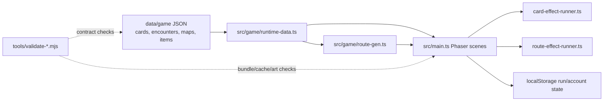

# Bird Squad Documentation Index

Status: documentation map and ownership guide.

This file is the first stop for project documentation. It explains which
documents are canonical, which are reference material, and where new decisions
should be recorded.

## Reading Paths

| Goal | Read |
| --- | --- |
| Understand the game in 10 minutes | `docs/game/game-design.md` |
| Implement combat, cards, Flock Stats, rewards, or Molt | `docs/game/core-gameplay-spec.md` |
| Implement the route map, economy, Signals, Markets, or bosses | `docs/game/run-design-spec.md` |
| Build or tune the first playable slice | `docs/game/alpha-run-spec.md` |
| Understand how code, data, scenes, and validators fit together | `docs/project/runtime-architecture.md` |
| Plan remaining runtime, bundle, and animation-smoothness work | `docs/project/runtime-remaining-work-plan.md` |
| Plan the next quality and implementation push | `docs/game/next-level-implementation-spec.md` |
| Review the current fun, beauty, onboarding, pacing, and retention audit | `docs/game/game-experience-audit.md` |
| Run and aggregate observed first-run sessions | `docs/game/playtest-runbook.md` |
| Run final cross-browser, human, device, and assistive-technology release checks | `docs/game/release-evidence-runbook.md` |
| Work on visual identity, card art, prompts, or style rules | `docs/art/art-bible.md` |
| Add, replace, or audit route, battlefield, landmark, market, or map-node art | `docs/art/world-asset-contract.md` |
| Plan future imagegen/chroma-key asset packs | `docs/art/imagegen-asset-roadmap.md` |
| Generate or review enemy art | `docs/art/enemy-art-bible.md` |
| Adapt external implementation patterns | `docs/game/spire-codex-adaptation-study.md` |
| Review historical decisions and handoff notes | `docs/project/progress.md` |

## Canonical Design Sources

| Document | Owns | Does Not Own |
| --- | --- | --- |
| `docs/game/game-design.md` | Pitch, pillars, narrative frame, vocabulary, and product direction. | Detailed combat math or Alpha tuning. |
| `docs/game/core-gameplay-spec.md` | Combat loop, card contract, Flock Stats, effect syntax, rewards, Molt, Open Sky, and enemy Tells. | Route-map topology or node economy. |
| `docs/game/run-design-spec.md` | Run structure, route maps, node types, Waymarks, Scrap, Markets, Signals, Supplies, Snags, Rival Crews, Basin/Nest rules, and bosses. | Alpha-only card lists and exact first-slice numbers. |
| `docs/game/alpha-run-spec.md` | Map 1 Alpha scope, starter deck, reward pool, Alpha enemies, boss, Waymarks, supplies, Signals, Snags, market prices, and tuning targets. | Full-run final balance. |
| `docs/art/art-bible.md` | Visual identity, suit aesthetics, prompt standards, card-art production rules, and runtime asset expectations. | Gameplay rules except where art needs them for context. |
| `docs/art/world-asset-contract.md` | Canonical runtime world-art inventory, retired paths, and replacement validation. | Card, enemy, or gameplay data. |
| `docs/art/aviary-generation-runbook.md` | Aviary card imagegen, master-border compositing, and QA workflow. | Minor Arcana suit generation details or gameplay tuning. |
| `docs/art/enemy-art-bible.md` | Enemy art visual language, non-humanoid animal constraints, and prompt pattern for enemy concepts. | Enemy combat tuning or encounter rewards. |
| `docs/project/runtime-architecture.md` | Current runtime wiring, scene ownership, data flow, effect-runner boundaries, and validation/build gates. | Product direction, balance numbers, or art direction. |

## Runtime Overview

Use `docs/project/runtime-architecture.md` when a change crosses code/data
boundaries, adds a new effect verb, changes route generation, or touches scene
ownership.

## Reference And Intake Documents

`docs/game/spire-codex-adaptation-study.md` is not canonical game design. Treat
it as an implementation pattern backlog. When a pattern is accepted for Bird
Squad, move the actual rule or data contract into the relevant canonical spec:

- combat pattern -> `core-gameplay-spec.md`
- route, market, event, or run-history pattern -> `run-design-spec.md`
- Alpha content change -> `alpha-run-spec.md`
- UI/engineering task -> implementation issue, progress note, or code

`docs/game/next-level-implementation-spec.md` is the current implementation
roadmap for the next quality push. It translates accepted findings into
sequenced work, but detailed rule changes should still graduate into the
canonical specs above as they are implemented.

Generated prompt packs under `docs/art/prompt-packs/` are production artifacts.
Regenerate them from tools instead of hand-editing unless a brief explicitly
requires a manual note.

## Data Versus Docs

Use docs for durable decisions and design intent. Use data files for playable
content:

| Data Path | Owns |
| --- | --- |
| `data/cards/arcana/` | Canonical card identities, species, rarity, descriptions, and art-production fields. |
| `data/cards/reversals/` | Molt/reversal overlays. |
| `data/game/` | Runtime-ready cards, Snags, enemies, encounters, route maps, route effects, Supplies, Waymarks, Signals, Markets, and district content. |
| `data/game/enemy-variety-contracts.json` | Reserve enemy roster and art contracts for future animal-species variety. |
| `.generated/` | Generated art masters, selected source PNGs, prompt/run provenance, and QA sheets. |
| `assets/runtime/` | Optimized game-ready card/enemy assets and runtime manifests. |

Docs may summarize content, but should not become a second source of truth for
runtime data.

## Progress Logs

`docs/project/progress.md` is the canonical progress and handoff log. It is
historical context, not a design source. Keep new handoff notes there instead of
creating new root-level progress files.

## Quality Rules

- Update only the document that owns the decision.
- Do not duplicate card lists, route payloads, or tuning tables across multiple
  docs unless one is explicitly an Alpha mirror.
- Keep speculative ideas in intake/reference docs until accepted.
- Record implemented changes in `docs/project/progress.md`.
- Run `npm run validate:docs` after changing game, art, card, or prompt docs.
