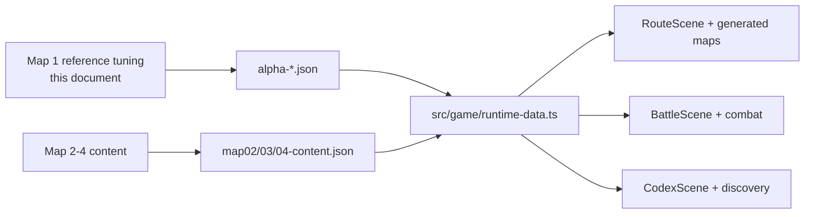

# Bird Squad Alpha Run Spec

Version: 0.1

Status: code-ready content target for the first playable roguelike slice.

Related sources:

- `docs/game/game-design.md` defines overall direction and player-facing terms.
- `docs/game/core-gameplay-spec.md` defines combat, cards, Flock Stats, and
  Molt.
- `docs/game/run-design-spec.md` defines the four-map route structure, Route
  Marks, Scrap, Markets, Signals, Supplies, Snags, Rival Crews, and boss
  rewards.
- `data/game/alpha-cards.json`, `data/game/alpha-enemies.json`, and
  `data/game/alpha-route-map.json` are the runtime-ready Alpha data mirrors of
  this spec.
- `data/game/map02-content.json`, `map03-content.json`, and
  `map04-content.json` hold the later district content now used by the full run.
- `docs/project/runtime-architecture.md` maps how these data files enter the
  current Phaser runtime.

## Purpose

The Alpha Run proves Bird Squad can work as a deckbuilding roguelike, not only a
combat prototype. It was intentionally Map 1 only, polished enough to test the
core loop before building the remaining three maps.

Map 1 only: Rooftop Blocks.

**Status (scope expanded):** the alpha slice is achieved, and the build has since
grown past it. All four districts (Rooftop Blocks -> Canal Markets -> Signal
Spires -> High Roost) are wired and playable. The runtime card file contains 110
cards total: 100 playable cards plus 10 Snags. This document still owns Map 1's
reference tuning; the targets below describe that Map 1 slice, not a cap on the
shipped build.

Alpha should answer one question:

> Is it fun to restore the first broken flyway through card combat, route
> choices, Flock growth, Waymarks, Scrap, Signals, Supplies, and a boss?

## Alpha Scope

| Area | Alpha Target |
| --- | --- |
| Maps | All 4 districts are playable; Map 1 (Rooftop Blocks) is the tuning reference detailed below. |
| Route length | 6-8 nodes plus boss. |
| Normal enemies | 3. |
| Rival Crew | 1. |
| Boss | 1 rival bird crew leader. |
| Starter deck | 10 cards. |
| Reward pool | 90 cards (every non-starter playable card; the full deck is implemented). |
| Snags | 10 runtime Snag cards. |
| Waymarks | 58. |
| Supplies | 31 shipped items; the original five-item set remains the starter pattern. |
| Signals | 38 across all districts; Map 1's original five remain the starter pattern. |
| Market | 1 inventory model. |
| Basin Stop | 1 recovery rule set with 4 options. |
| Nest Workshop | 1 upgrade/removal/preparation rule set with 4 options. |

Out of scope for the original Alpha cut (note: Maps 2-4 have since shipped as
playable routes):

- Favors
- broad Bad Signal system
- Flock Leader variants
- complex event chains
- advanced parked mechanics such as Mark, Bond, Shine, Scry, Discover,
  Seed, Route, and temporary cards

## Map 1 Frame

Map 1 is `Rooftop Blocks`.

Narrative:

The local roofline is the first broken flyway. Old chalk marks have faded,
repair perches are stripped, and a rival corvid line-worker is charging passage
through the best crossing. The flock needs to reopen this route before it can
reach the Canal Markets.

Alpha map promise:

- teach the route map
- teach enemy Tells
- teach Cover and damage
- teach recovery pressure
- teach `Add to the Flock`
- teach `Preen a Card`
- introduce Scrap and Markets
- introduce Waymarks and Supplies
- end with a boss that tests Molt and Open Sky

## Route Shape

Alpha should use a small deterministic route graph before procedural generation
is generalized.

| Column | Node Options | Notes |
| --- | --- | --- |
| 0 | Street Encounter | Fixed opening fight. |
| 1 | Street Encounter, Signal | First route choice. |
| 2 | Basin, Nest, Street Encounter | First recovery versus upgrade decision. |
| 3 | Rival Crew, Market, Rooftop Cache | Risk/reward fork. |
| 4 | Street Encounter, Signal | Final tuning before boss lane. |
| 5 | Basin, Nest | Last safety or power choice. |
| 6 | Boss | Fixed endpoint. |

Minimum route requirements:

- every route has at least 3 combats before the boss
- every route has at least 1 non-combat node
- every route offers either a Basin or Nest before the boss
- at least one route exposes the Rival Crew
- at least one route exposes the Market

## Starting Run State

| Value | Alpha Target |
| --- | ---: |
| Starting Cohesion | 36 |
| Starting Wingbeats | 3 |
| Starting hand target | 4 |
| Starting Resonance cap | 5 |
| Starting Scrap | 60 |
| Supply slots | 2 |
| Starting Waymarks | 0 |
| Starting Snags | 0 |

Discard effects are explicit combat decisions. `discard(N)` requires the exact
available count, while `discardUpTo(N)` permits zero through N; later
`perDiscarded` values use the confirmed count. The choice occurs in written
effect order, so a preceding draw is visible and eligible. A held Snag cannot
discard itself while resolving its own Roost effect, preventing a self-shuffle
from leaving duplicate copies across zones.

Discard recovery is also an explicit decision. `returnDiscard(filter,
drawAfter)` pauses when reached, presents every currently eligible discard card
with its live cost, role, and rules, returns the player's chosen card, then
draws the authored follow-up count. The committed card or Supply finishes only
after that choice; an empty eligible pool continues immediately without
inventing a card or consuming another effect.

## Starter Deck

The starter deck should teach all four suits and Molt. It is also the baseline
for tuning enemy health.

| ID | Card | Suit | Cost | Base Effect | Improved Effect |
| --- | --- | --- | ---: | --- | --- |
| `major_00` | First Flight | Legend | 1 | Deal 3. Gain 2 Cover. First time played each combat, draw 1. | Deal 5. Gain 4 Cover. First time played each combat, draw 1 and gain 1 Wingbeat. |
| `wands_ace` | Plume Flash | Plumes | 1 | Deal 2, plus 2 more if Resonance is held. Gain 1 Resonance. | Deal 3, plus 3 more and draw 1 if Resonance is held. Gain 2 Resonance. |
| `wands_08` | Plume Rush | Plumes | 0 | Draw 1. If Molting, gain 1 Wingbeat. | Draw 2. If Molting, gain 1 Wingbeat. |
| `swords_02` | Crossed Quills | Quills | 1 | Deal 4, plus 3 if the target is below half health. | Deal 5, plus 4 and gain 1 Wingbeat if the target is below half health. |
| `swords_ace` | Quill Point | Quills | 1 | Deal 3. If the target is already Winded, draw 1. Apply 1 Winded. | Deal 5. If the target is already Winded, draw 1 and gain 1 Wingbeat. Apply 1 Winded. |
| `cups_ace` | Open Basin | Basins | 1 | Heal 3 Cohesion. If at full Cohesion, draw 1. | Heal 5 Cohesion. If at full Cohesion, draw 1 and gain 1 Open Sky Guard. |
| `cups_03` | Basin Chorus | Basins | 1 | Heal 2 and draw 1. At full Cohesion, gain 1 Open Sky Guard. | Heal 3 and draw 1. At full Cohesion, gain 2 Open Sky Guard and retain 1 card. |
| `pentacles_04` | Locked Nest | Nests | 1 | Gain 6 Cover and retain 1 card. If this fully blocks the next attack, draw 1 extra next turn. | Gain 8 Cover and retain 1 card. If this fully blocks the next attack, draw 2 extra next turn and gain 1 Open Sky Guard. |
| `pentacles_02` | Nest Juggle | Nests | 1 | Gain 4 Cover. Draw 1, then discard 1. Retain 1 if this fully blocks the next attack. | Gain 6 Cover. Draw 1, then discard 1. Retain 1 and gain 1 Wingbeat if this fully blocks the next attack. |
| `aviary_25` | Hot Feathers | Molt | 0 | Enter Molt. | Enter Molt. Gain 1 Open Sky Guard this combat. |

## Alpha Reward Pool

The full playable deck (100 cards) is implemented; the reward pool is every
playable card not in the starter deck, so any card can be acquired across a run.
`data/game/alpha-cards.json` also contains 10 Snags. Snags are not reward-pool
cards and do not contribute beneficial Flock Stats.

Reward rules:

- Rewards offer up to 3 unowned cards.
- Reward cards must respect singleton ownership.
- Offers are rarity-weighted (common 100 / uncommon 45 / rare 16 / legendary 5),
  so Common/uncommon rewards dominate Map 1 and rares appear occasionally.
- Rare cards can appear, but should not solve the run by themselves.
- Major Legend and legendary Aviary cards are heavily down-weighted, so they read
  as rare treats rather than staple street rewards. Lower-rarity Aviary quality
  cards follow the normal rarity weights and are not treated as tarot cards.
- Every one of the 90 reward cards has a strategic Preen: upgrading changes a
  condition, sequencing choice, effect, or cost instead of only increasing
  numbers. Runtime validation enforces this across every rarity.

| ID | Card | Suit | Rarity | Cost | Base Effect | Improved Effect |
| --- | --- | --- | --- | ---: | --- | --- |
| `wands_02` | Twin Plume Lookout | Plumes | Common | 1 | If Resonance is held, bank 1 Wingbeat. Gain 1 Resonance and draw 1. | If Resonance is held, bank 1 Wingbeat and retain 1 card. Gain 2 Resonance and draw 1. |
| `wands_03` | Plume Horizon | Plumes | Common | 1 | Deal 3. Spend 1 Resonance to draw 1 and deal 2 more. | Deal 5. Spend 1 Resonance to draw 2, deal 3 more, and gain 1 Wingbeat. |
| `wands_04` | Plume Street Party | Plumes | Common | 1 | Gain 2 Resonance. Gain 2 Cover. | Gain 3 Resonance. Gain 3 Cover. |
| `wands_05` | Plume Clash | Plumes | Common | 1 | Deal 4. Spend 2 Resonance to deal 5 more. | Deal 6. Spend 2 Resonance to deal 7 more and apply 1 Winded. |
| `wands_06` | Plume Victory Wire | Plumes | Uncommon | 1 | Deal 5. If this defeats an enemy, gain 1 Wingbeat. | Deal 7. If this defeats an enemy, gain 1 Wingbeat and draw 1. |
| `wands_09` | Plume Barricade | Plumes | Uncommon | 1 | Gain 4 Cover and 1 Resonance. Against a covered target, strip 2 Cover. | Gain 6 Cover and 2 Resonance. Against a covered target, gain 1 Wingbeat and strip 3 Cover. |
| `swords_03` | Storm Quill | Quills | Common | 1 | Deal 5. If the enemy intends to attack, apply 1 Winded. | Deal 7. If the enemy intends to attack, apply 1 Winded and gain 2 Cover. |
| `swords_04` | Sheathed Quills | Quills | Common | 0 | Against a covered target, draw 1 then discard 1. Strip 4 Cover and gain 3 Cover. | Against a covered target, draw 1, discard 1, and gain 1 Resonance. Strip 6 Cover and gain 5 Cover. |
| `swords_05` | Scattered Quills | Quills | Common | 1 | Deal 2 to all enemies. Against a covered target, gain 1 Resonance and strip 3 Cover. | Deal 3 to all enemies. Against a covered target, gain 1 Resonance, draw 1 extra next turn, and strip 5 Cover. |
| `swords_fledgling` | Quill Fledgling | Quills | Common | 1 | Deal 4. Draw 1 if the target has at least 2 Winded. | Deal 6. If the target has at least 2 Winded, draw 2 and gain 1 Wingbeat. |
| `swords_06` | Quill Crossing | Quills | Uncommon | 1 | Lose 2 Cohesion. Deal 9. | Lose 2 Cohesion and deal 13. If this leaves Cohesion below half, gain 1 Wingbeat. |
| `swords_07` | Quill Slip | Quills | Uncommon | 0 | Deal 2, plus 3 if the target is Winded and 2 if Molting. | Deal 3, plus 4 if the target is Winded and 3 if Molting. Against a Winded target, gain 1 Resonance. |
| `cups_02` | Twin Basin Bond | Basins | Common | 1 | Heal 2 and gain 3 Cover. At full Cohesion, retain 1 card. | Heal 3 and gain 4 Cover. At full Cohesion, retain 1 card and bank 1 Wingbeat. |
| `cups_04` | Closed Basin | Basins | Common | 1 | Gain 4 Cover and heal 1. In Open Sky, gain 2 Open Sky Guard. | Gain 6 Cover and heal 2. In Open Sky, gain 2 Open Sky Guard and draw 1. |
| `cups_05` | Spilled Basin | Basins | Common | 1 | Gain 3 Cover and heal 2. In Open Sky, gain 4 more Cover. | Gain 4 Cover and heal 3. In Open Sky, gain 5 more Cover and retain 1 card. |
| `cups_fledgling` | Basin Fledgling | Basins | Common | 0 | Heal 1. Draw 1. | Heal 2. Draw 1. |
| `cups_06` | Basin Memory | Basins | Uncommon | 1 | Return a non-Molt card from discard to hand. Heal 2. | Return a non-Molt card from discard to hand, heal 3, and retain 1 card. |
| `cups_08` | Basin Walkaway | Basins | Uncommon | 1 | Discard up to 2 cards. Heal 3 and gain 2 Cover for each discarded. | Discard up to 2 cards. Heal 5 and gain 4 Cover for each discarded. If this reaches full Cohesion, draw 1 extra next turn. |
| `pentacles_ace` | Nest Seed | Nests | Common | 1 | Gain 5 Cover and 1 Open Sky Guard. | Gain 7 Cover and 2 Open Sky Guard. In Open Sky, draw 1 extra next turn. |
| `pentacles_03` | Nest Blueprint | Nests | Common | 1 | Gain 3 Cover. The next Nest gains +4 Cover. | Gain 4 Cover, prime the next Nest for +6 Cover, and retain 1 card. |
| `pentacles_05` | Cold Nest | Nests | Common | 1 | Gain 5 Cover, plus 3 below half Cohesion. Retain 1 if this fully blocks the next attack. | Gain 7 Cover, plus 4 and 1 Open Sky Guard below half Cohesion. Retain 1 if this fully blocks the next attack. |
| `pentacles_fledgling` | Nest Fledgling | Nests | Common | 0 | Gain 2 Cover and retain 1 card. | Gain 4 Cover and retain 1 card. If this fully blocks the next attack, prime the next Nest brace for +2 Cover. |
| `pentacles_06` | Shared Nest | Nests | Uncommon | 1 | Gain 4 Cover, heal 2, and prime the next Nest for +2 Cover. | Gain 6 Cover, heal 3, and prime the next Nest for +3 Cover. If fully braced, gain 1 Wingbeat. |
| `pentacles_08` | Workshop Nest | Nests | Uncommon | 2 | Gain 8 Cover. If this fully blocks the next attack, draw 1 next turn. | Gain 11 Cover. If this fully blocks the next attack, draw 1 next turn and retain 1 card. |
| `aviary_28` | Hover Check | Aviary | Common | 0 | Draw 1, then discard 1. | Draw 1, discard 1, and gain 2 Cover. |
| `aviary_29` | Mobbing Call | Aviary | Common | 1 | Deal 3 and apply 1 Winded. Against an attacker, gain 3 Cover. | Deal 4 and apply 2 Winded. Against an attacker, gain 4 Cover and 1 Wingbeat. |
| `aviary_30` | Underwing Shelter | Aviary | Common | 1 | Gain 3 Cover and heal 2. In Open Sky, gain 1 Open Sky Guard. | Gain 5 Cover and heal 3. In Open Sky, gain 1 Open Sky Guard and retain 1 card. |
| `aviary_31` | Scavenger Eye | Aviary | Common | 1 | Against a covered target, gain 1 Resonance. Strip 3 Cover and draw 1. | Against a covered target, gain 1 Resonance and 1 Wingbeat. Strip 5 Cover and draw 1. |
| `aviary_32` | Thermal Lift | Aviary | Uncommon | 1 | Gain 1 Wingbeat. If Open Sky, gain 1 Open Sky Guard. Draw 1 extra next turn. | Gain 1 Wingbeat. If Open Sky, gain 2 Open Sky Guard and retain 1 card. Draw 1 extra next turn. |
| `aviary_33` | Cache Memory | Aviary | Uncommon | 1 | Return a non-Molt card from discard to hand. At full Cohesion, draw 1. | Return a non-Molt card from discard to hand. At full Cohesion, draw 1; retain 1 card regardless. |
| `aviary_34` | Brood Shield | Aviary | Uncommon | 1 | Gain 6 Cover. If Cohesion is below half, heal 2. | Gain 8 Cover. If Cohesion is below half, heal 3 and retain 1 card. |
| `aviary_35` | Mimic Thread | Aviary | Rare | 1 | Deal 3. Gain a bonus from each suit already played this turn. | Deal 4. Gain stronger suit bonuses; a prior Plume also grants 1 Wingbeat. |
| `aviary_36` | Drumline Tap | Aviary | Common | 1 | Deal 2 to all enemies. First time played each combat, gain 1 Resonance. | Deal 3 to all enemies. First time played each combat, gain 2 Resonance and draw 1 extra next turn. |
| `aviary_37` | Curb Step | Aviary | Common | 1 | Gain 3 Cover and 1 Wingbeat. In Open Sky, gain 1 Guard; if fully braced, draw 1 extra next turn. | Gain 5 Cover and 1 Wingbeat. In Open Sky, gain 2 Guard; if fully braced, draw 1 extra next turn and retain 1 card. |
| `aviary_38` | Spiral Search | Aviary | Common | 0 | Gain 1 Cover and, in Open Sky, 1 Guard. Shuffle this card into the draw pile. | Gain 2 Cover and 1 Open Sky Guard unconditionally. Shuffle this card into the draw pile. |
| `aviary_39` | Reed Balance | Aviary | Common | 1 | Heal 1 and gain 4 Cover. At full Cohesion, draw 1. | Heal 2 and gain 5 Cover. At full Cohesion, draw 1 and gain 1 Resonance. |
| `aviary_40` | Plunge Claim | Aviary | Uncommon | 1 | Deal 4 piercing. If the target has Cover, remove 4 Cover. | Deal 6 piercing. If the target has Cover, gain 1 Wingbeat and remove 6 Cover. |
| `aviary_41` | Cold Plunge | Aviary | Uncommon | 1 | Gain 1 Open Sky Guard. Heal 2. If Open Sky, draw 1. | Gain 2 Open Sky Guard and heal 3. If Open Sky, draw 1 and retain 1 card. |
| `aviary_42` | Formation Draft | Aviary | Uncommon | 2 | Gain 1 Wingbeat. With 3 Plumes, draw 1; with 3 Nests, gain 3 Cover. | Gain 1 Wingbeat. With 3 Plumes, draw 1; with 3 Nests, gain 5 Cover; with 3 Basins, heal 2. |
| `aviary_43` | Tool Probe | Aviary | Rare | 1 | Return a non-Molt card from discard to hand, then draw 1. First time played each combat, gain 1 Wingbeat. | Return a non-Molt card from discard to hand, then draw 1. First time played each combat, gain 2 Wingbeat. Draw 1. |

## Alpha Card Implementation Contract

Alpha card data should use the normalized effect syntax from
`docs/game/core-gameplay-spec.md`. Player-facing copy may be shorter, but tests
and runtime data should preserve the ordered effect expressions below.

Flock Stat rules:

- Every Alpha card grants at least one whole-number Flock Stat.
- Base Flock Stats apply while the card is owned.
- Preen Delta applies only after the card is improved.
- These values are first-pass Alpha tuning, not final full-run balance.

Stance identity rule:

- Every base and Preened Normal or Molt stance must have a distinct active
  gameplay identity across different cards. Two cards may share vocabulary,
  but they cannot share the same cost, active target, and ordered effect list.
  Runtime validation enforces this across all 420 active card stances.

| ID | Target | Tags | Base Effects | Improved Effects | Base Flock Stats | Preen Delta |
| --- | --- | --- | --- | --- | --- | --- |
| `major_00` | enemy | attack, cover, draw | `damage(target, 3); gainCover(2); if firstPlayedThisCombat then draw(1)` | `damage(target, 5); gainCover(4); if firstPlayedThisCombat then draw(1)` | `Cohesion +2; Draw +1` | `Cohesion +1` |
| `wands_ace` | enemy | attack, resonance | `damage(target, 2); gainResonance(1)` | `damage(target, 3); gainResonance(2)` | `Resonance +1` | `Resonance +1` |
| `wands_08` | none | draw, tempo | `draw(1); if isMolting then gainWingbeat(1)` | `draw(2); if isMolting then gainWingbeat(1)` | `Draw +1` | `Resonance +1` |
| `swords_02` | enemy | attack, finisher | `damage(target, 4); if targetBelowHalf then damage(target, 3)` | `damage(target, 5); if targetBelowHalf then damage(target, 4); if targetBelowHalf then gainWingbeat(1)` | `Damage +1` | `Damage +1` |
| `swords_ace` | enemy | attack, winded | `damage(target, 3); applyWinded(target, 1)` | `damage(target, 5); applyWinded(target, 1)` | `Damage +1` | `Damage +1` |
| `cups_ace` | self | heal, draw | `heal(3); if fullCohesion then draw(1)` | `heal(5); if fullCohesion then draw(1)` | `Regen +1` | `Cohesion +1` |
| `cups_03` | self | heal, draw, full-cohesion | `heal(2); draw(1); if fullCohesion then gainOpenSkyGuard(1)` | `heal(3); draw(1); if fullCohesion then gainOpenSkyGuard(2); if fullCohesion then retainHand(1)` | `Cohesion +1` | `Regen +1` |
| `pentacles_04` | self | cover | `gainCover(7)` | `gainCover(10)` | `Cover +1` | `Cover +1` |
| `pentacles_02` | self | cover, draw, discard | `gainCover(4); draw(1); discard(1); if fullyBlocksNextAttack then retainHand(1)` | `gainCover(6); draw(1); discard(1); if fullyBlocksNextAttack then retainHand(1); if fullyBlocksNextAttack then gainWingbeat(1)` | `Cover +1` | `Draw +1` |
| `aviary_25` | none | molt | `enterMolt()` | `enterMolt(); gainOpenSkyGuard(1)` | `Molt Power +1; Open Sky Guard +1` | `Open Sky Guard +1` |
| `wands_02` | none | resonance, draw | `if hasResonance then gainEnergyNextTurn(1); gainResonance(1); draw(1)` | `if hasResonance then gainEnergyNextTurn(1); if hasResonance then retainHand(1); gainResonance(2); draw(1)` | `Resonance +1` | `Draw +1` |
| `wands_03` | enemy | attack, draw, resonance | `damage(target, 3); if hasResonance then spendResonance(1); if spentResonance then draw(1); if spentResonance then damage(target, 2)` | `damage(target, 5); if hasResonance then spendResonance(1); if spentResonance then draw(2); if spentResonance then damage(target, 3); if spentResonance then gainWingbeat(1)` | `Resonance +1` | `Damage +1` |
| `wands_04` | self | resonance, cover | `gainResonance(2); gainCover(2)` | `gainResonance(3); gainCover(3)` | `Resonance +1` | `Cover +1` |
| `wands_05` | enemy | attack, resonance | `damage(target, 4); if resonanceAtLeast(2) then spendResonance(2); if spentResonance then damage(target, 5)` | `damage(target, 6); if resonanceAtLeast(2) then spendResonance(2); if spentResonance then damage(target, 7); if spentResonance then applyWinded(target, 1)` | `Damage +1` | `Resonance +1` |
| `wands_06` | enemy | attack, tempo, draw | `damage(target, 5); if defeatsEnemy then gainWingbeat(1)` | `damage(target, 7); if defeatsEnemy then gainWingbeat(1); if defeatsEnemy then draw(1)` | `Resonance +2` | `Damage +1` |
| `wands_09` | enemy | cover, resonance, cover-break | `gainCover(4); gainResonance(1); if targetHasCover then removeCover(target, 2)` | `gainCover(6); gainResonance(2); if targetHasCover then gainWingbeat(1); if targetHasCover then removeCover(target, 3)` | `Resonance +2` | `Cover +1` |
| `swords_03` | enemy | attack, tell, winded | `damage(target, 5); if targetIntendsAttack then applyWinded(target, 1)` | `damage(target, 7); if targetIntendsAttack then applyWinded(target, 1); if targetIntendsAttack then gainCover(2)` | `Damage +1` | `Damage +1` |
| `swords_04` | enemy | cover, draw, discard, cover-break | `if targetHasCover then draw(1); if targetHasCover then discard(1); removeCover(target, 4); gainCover(3)` | `if targetHasCover then draw(1); if targetHasCover then discard(1); if targetHasCover then gainResonance(1); removeCover(target, 6); gainCover(5)` | `Draw +1` | `Damage +1` |
| `swords_05` | allEnemies | attack, aoe | `damageAll(2); if targetHasCover then gainResonance(1); if targetHasCover then removeCover(target, 3)` | `damageAll(3); if targetHasCover then gainResonance(1); if targetHasCover then nextTurnDraw(1); if targetHasCover then removeCover(target, 5)` | `Damage +1` | `Damage +1` |
| `swords_fledgling` | enemy | attack, winded, draw | `damage(target, 4); if targetWinded then draw(1)` | `damage(target, 6); if targetWinded then draw(1)` | `Damage +1` | `Draw +1` |
| `swords_06` | enemy | attack, cover | `loseCohesion(2); damage(target, 9)` | `loseCohesion(2); damage(target, 13); if cohesionBelowHalf then gainWingbeat(1)` | `Damage +2` | `Cover +1` |
| `swords_07` | enemy | attack, molt | `damage(target, 2); if targetWinded then damage(target, 3); if isMolting then damage(target, 2)` | `damage(target, 3); if targetWinded then damage(target, 4); if isMolting then damage(target, 3); if targetWinded then gainResonance(1)` | `Damage +2` | `Molt Power +1` |
| `cups_02` | self | heal, cover, retain | `heal(2); gainCover(3); if fullCohesion then retainHand(1)` | `heal(3); gainCover(4); if fullCohesion then retainHand(1); if fullCohesion then gainEnergyNextTurn(1)` | `Cohesion +1` | `Cover +1` |
| `cups_04` | self | cover, heal, open-sky | `gainCover(4); heal(1); if openSky then gainOpenSkyGuard(2)` | `gainCover(6); heal(2); if openSky then gainOpenSkyGuard(2); if openSky then draw(1)` | `Cohesion +1` | `Regen +1` |
| `cups_05` | self | cover, heal, open-sky | `gainCover(3); heal(2); if openSky then gainCover(4)` | `gainCover(4); heal(3); if openSky then gainCover(5); if openSky then retainHand(1)` | `Open Sky Guard +1` | `Cohesion +1` |
| `cups_fledgling` | self | heal, draw | `heal(1); draw(1)` | `heal(2); draw(1)` | `Regen +1` | `Draw +1` |
| `cups_06` | choice | discard, recursion | `returnDiscard(nonMolt, +1); heal(2)` | `returnDiscard(nonMolt, +1); heal(3); retainHand(1)` | `Cohesion +2` | `Draw +1` |
| `cups_08` | self | discard, heal | `discardUpTo(2); heal(3 perDiscarded); gainCover(2 perDiscarded)` | `discardUpTo(2); heal(5 perDiscarded); gainCover(4 perDiscarded); if fullCohesion then nextTurnDraw(1)` | `Regen +2` | `Cohesion +1; Regen +1` |
| `pentacles_ace` | self | cover, open-sky | `gainCover(5); gainOpenSkyGuard(1)` | `gainCover(7); gainOpenSkyGuard(2); if openSky then nextTurnDraw(1)` | `Cover +1` | `Cover +1` |
| `pentacles_03` | self | cover, setup | `gainCover(3); nextCoverBonus(nests, 4)` | `gainCover(4); nextCoverBonus(nests, 6); retainHand(1)` | `Cover +1` | `Cover +1` |
| `pentacles_05` | self | cover, low-cohesion, restraint | `gainCover(5); if cohesionBelowHalf then gainCover(3); if fullyBlocksNextAttack then retainHand(1)` | `gainCover(7); if cohesionBelowHalf then gainCover(4); if cohesionBelowHalf then gainOpenSkyGuard(1); if fullyBlocksNextAttack then retainHand(1)` | `Cohesion +1` | `Cover +1` |
| `pentacles_fledgling` | self | cover, retain | `gainCover(2); retainHand(1)` | `gainCover(4); retainHand(1)` | `Cover +1` | `Cohesion +1` |
| `pentacles_06` | self | cover, heal, setup | `gainCover(4); heal(2); nextCoverBonus(nests, 2)` | `gainCover(6); heal(3); nextCoverBonus(nests, 3); if fullyBlocksNextAttack then gainWingbeat(1)` | `Cover +2` | `Cohesion +1` |
| `pentacles_08` | self | cover, draw-next | `gainCover(8); if fullyBlocksNextAttack then nextTurnDraw(1)` | `gainCover(11); if fullyBlocksNextAttack then nextTurnDraw(1); if fullyBlocksNextAttack then retainHand(1)` | `Cover +2` | `Draw +1` |
| `aviary_28` | self | draw, discard, tempo | `draw(1); discard(1)` | `draw(1); discard(1); gainCover(2)` | `Draw +1` | `Draw +1` |
| `aviary_29` | enemy | attack, winded, tell | `damage(target, 3); applyWinded(target, 1); if targetIntendsAttack then gainCover(3)` | `damage(target, 4); applyWinded(target, 2); if targetIntendsAttack then gainCover(4); if targetIntendsAttack then gainWingbeat(1)` | `Damage +1` | `Damage +1` |
| `aviary_30` | self | cover, heal | `gainCover(3); heal(2); if openSky then gainOpenSkyGuard(1)` | `gainCover(5); heal(3); if openSky then gainOpenSkyGuard(1); if openSky then retainHand(1)` | `Cohesion +1` | `Cohesion +1` |
| `aviary_31` | enemy | cover, draw, utility | `if targetHasCover then gainResonance(1); removeCover(target, 3); draw(1)` | `if targetHasCover then gainResonance(1); if targetHasCover then gainWingbeat(1); removeCover(target, 5); draw(1)` | `Draw +1` | `Draw +1` |
| `aviary_32` | none | tempo, open-sky, draw | `gainWingbeat(1); if openSky then gainOpenSkyGuard(1); nextTurnDraw(1)` | `gainWingbeat(1); if openSky then gainOpenSkyGuard(2); nextTurnDraw(1); if openSky then retainHand(1)` | `Open Sky Guard +1; Draw +1` | `Open Sky Guard +1` |
| `aviary_33` | choice | recursion, draw | `returnDiscard(nonMolt, +1); if fullCohesion then draw(1)` | `returnDiscard(nonMolt, +1); if fullCohesion then draw(1); retainHand(1)` | `Cohesion +1; Draw +1` | `Draw +1` |
| `aviary_34` | self | cover, heal | `gainCover(6); if cohesionBelowHalf then heal(2)` | `gainCover(8); if cohesionBelowHalf then heal(3); if cohesionBelowHalf then retainHand(1)` | `Cover +1; Cohesion +1` | `Cohesion +1` |
| `aviary_35` | enemy | attack, resonance, winded, heal, cover | `damage(target, 3); if playedSuitThisTurn(plumes) then gainResonance(1); if playedSuitThisTurn(quills) then applyWinded(target, 1); if playedSuitThisTurn(basins) then heal(2); if playedSuitThisTurn(nests) then gainCover(3)` | `damage(target, 4); if playedSuitThisTurn(plumes) then gainResonance(2); if playedSuitThisTurn(plumes) then gainWingbeat(1); if playedSuitThisTurn(quills) then applyWinded(target, 2); if playedSuitThisTurn(basins) then heal(3); if playedSuitThisTurn(nests) then gainCover(4)` | `Draw +1; Damage +1` | `Draw +1; Damage +1` |
| `aviary_36` | allEnemies | attack, aoe, opener, resonance | `damageAll(2); if firstPlayedThisCombat then gainResonance(1)` | `damageAll(3); if firstPlayedThisCombat then gainResonance(2); if firstPlayedThisCombat then nextTurnDraw(1)` | `Damage +1` | `Damage +1` |
| `aviary_37` | self | cover, tempo, open-sky | `gainCover(3); gainWingbeat(1); if openSky then gainOpenSkyGuard(1); if fullyBlocksNextAttack then nextTurnDraw(1)` | `gainCover(5); gainWingbeat(1); if openSky then gainOpenSkyGuard(2); if fullyBlocksNextAttack then nextTurnDraw(1); if fullyBlocksNextAttack then retainHand(1)` | `Cover +1` | `Cover +1` |
| `aviary_38` | none | cover, recursion, loop | `gainCover(1); if openSky then gainOpenSkyGuard(1); shuffleSelfToDraw()` | `gainCover(2); gainOpenSkyGuard(1); shuffleSelfToDraw()` | `Draw +1` | `Draw +1` |
| `aviary_39` | self | heal, cover, draw | `heal(1); gainCover(4); if fullCohesion then draw(1)` | `heal(2); gainCover(5); if fullCohesion then draw(1); if fullCohesion then gainResonance(1)` | `Cohesion +1` | `Cohesion +1` |
| `aviary_40` | enemy | attack, pierce, cover | `damagePierce(target, 4); if targetHasCover then removeCover(target, 4)` | `damagePierce(target, 6); if targetHasCover then gainWingbeat(1); if targetHasCover then removeCover(target, 6)` | `Damage +2` | `Damage +1` |
| `aviary_41` | self | open-sky, heal, draw | `gainOpenSkyGuard(1); heal(2); if openSky then draw(1)` | `gainOpenSkyGuard(2); heal(3); if openSky then draw(1); if openSky then retainHand(1)` | `Open Sky Guard +1; Cohesion +1` | `Open Sky Guard +1` |
| `aviary_42` | none | tempo, draw, cover, formation | `gainWingbeat(1); if flockSuit(plumes,3) then draw(1); if flockSuit(nests,3) then gainCover(3)` | `gainWingbeat(1); if flockSuit(plumes,3) then draw(1); if flockSuit(nests,3) then gainCover(5); if flockSuit(basins,3) then heal(2)` | `Draw +1; Open Sky Guard +1` | `Open Sky Guard +1` |
| `aviary_43` | choice | recursion, tempo, draw | `returnDiscard(nonMolt, +1); if firstPlayedThisCombat then gainWingbeat(1)` | `returnDiscard(nonMolt, +1); if firstPlayedThisCombat then gainWingbeat(2); draw(1)` | `Draw +1; Resonance +1` | `Draw +1; Resonance +1` |

## Alpha Enemies

Enemy intent must be visible before the player commits cards.

| Enemy | Type | Health | Lesson | Intent Pattern |
| --- | --- | ---: | --- | --- |
| Roof Rat | Normal | 20 | Read a basic attack Tell and use Cover. | Strike 6, Strike 6, Scurry: gain 4 Cover, repeat. |
| Signal Gull | Normal | 24 | Manage Brace and Scavenge. | Peck 5, Scavenge: heal 4 unless damaged this turn, Brace: gain 6 Cover, repeat. |
| Wire Hawk | Normal | 28 | Respect Heavy Strike and Open Sky risk. | Watch: apply 1 Winded, Heavy Strike 11, Strike 7, repeat. |
| Tarline Jackdaw | Rival Crew | 34 | Optional elite pressure with better rewards. | Harass 6 and apply 1 Winded, Brace 8 Cover, Heavy Strike 12, repeat. |

Normal encounter rewards:

- 25-40 Scrap
- `Add to the Flock`
- 25% chance to offer `Preen a Card`
- 15% chance to offer a common Waymark instead of Preen

Rival Crew rewards:

- 70-90 Scrap
- `Add to the Flock` with improved rarity odds
- guaranteed `Preen a Card`
- guaranteed Waymark offer from 3 choices

## Alpha Boss

Boss: `The Tar-Crowned Crow`

Role:

A rival corvid toll boss who controls the final rooftop crossing out of the
Rooftop Blocks. The crow is not evil for its own sake: it has been hoarding safe
Waymarks, Scrap, and warning access because scarcity made passage valuable.

Narrative beat:

Defeating the Tar-Crowned Crow breaks the first chokepoint, restores the local
roofline, and opens the route toward the Canal Markets.

Stats:

| Value | Target |
| --- | ---: |
| Health | 46 |
| Fight length | 6-8 player turns |
| Reward Scrap | 120 |

Intent pattern:

| Turn | Intent | Rule |
| --- | --- | --- |
| 1 | Toll Line | Gain 8 Cover. Add `Tangled Line` to discard if the Flock has no Cover. |
| 2 | Crowbar Tap | Deal 8. |
| 3 | Tar Toss | Deal 5. Apply Open Sky for 1 enemy turn if already Molting. |
| 4 | Chokepoint Call | Gain 6 Cover. Next attack deals +3. |
| 5 | Heavy Strike | Deal 13. |
| 6+ | Repeat from Turn 2 | Continue pressure until defeated. |

Boss rewards:

- choose 1 of 3 boss Waymarks
- choose 1 rare card from 3 options
- Preen 1 card
- gain 120 Scrap
- unlock Map 2 in later builds

## Waymarks

Alpha Waymarks are real carried artifact items: chalked route shards, patched
harness pieces, tins, charms, signal tags, and boss trophies. They are the
relic-equivalent run identity layer. The runtime still stores them in the
legacy `routeMarks` field, but player-facing text should say Waymarks.

The shipped runtime pool contains 58 Waymarks:

| Family | Count | Role |
| --- | ---: | --- |
| Safety | 8 | Defense, healing, and survival. |
| Route | 9 | Signals, Caches, route preview, and path value. |
| Economy | 11 | Scrap, Markets, purchases, and exchange rates. |
| Suit | 20 | Plumes, Quills, Basins, and Nests build engines. |
| Molt | 8 | Open Sky safety and transformation payoff. |
| Boss Prep | 2 | Strong map-clear artifacts and boss preparation. |

Representative Waymarks:

| Waymark | Source | Effect |
| --- | --- | --- |
| Chalk Wingmark | Street Encounter / Cache | Start each combat with 2 Cover. |
| Rooftop Shortcut | Signal / Cache | The first time you play 3 cards in a turn each combat, draw 1. |
| Patched Harness | Market | Market Preen costs 30 less Scrap. |
| Quiet Landing | Rival Crew | The first Open Sky damage increase each combat is reduced by 1. |
| Loose Change Tin | Market / Cache | Gain 15 extra Scrap after each Street Encounter. |
| Rain Gutter | Market / Cache | Basin Stops heal 4 more Cohesion. |
| Wire Map | Market / Cache | Signals pay out 25 Scrap. |
| Crowbar Debt | Boss | Start each combat with 1 Wingbeat on turn 1 only. |
| Reopened Roofline | Boss | At the start of each map, gain 1 Supply choice. |

## Supplies

The player can carry 2 Supplies by default. Later route items can expand that capacity.

When a direct route option says “Choose 1 of 2 Supplies,” the reward review
shows two deterministic, unowned Supply offers before anything is packed. The
first activation selects and the second confirms; cancelling restores the
uncommitted route choice. Passive `gainSupplyChoice(1)` triggers that occur
outside a route decision continue to stash one seeded Supply automatically.

The Packed Supplies drawer follows the same guarded commitment contract during
route and combat play. Run Kit (`X` by default) or controller X opens it;
Previous/Next, arrows, Tab, or D-pad browse phase-usable items; Confirm/A or a
pointer activation selects, and the same activation again consumes. Back/B
cancels a selected item before it closes the drawer.

| Supply | Type | Effect |
| --- | --- | --- |
| Seed Packet | Snack | Heal 6 Cohesion. |
| Signal Flare | Flare | Gain 2 Resonance. Draw 1. |
| Zip Tie Roll | Tool | Gain 10 Cover. |
| Emergency Call | Call | Gain 1 Wingbeat. Draw 1. |
| Shade Cloth | Tool | Reduce the next Open Sky damage increase by 2. |

The shipped Supply pool has expanded to 31 items across combat, route, and
either-timing use: 4 snacks, 6 flares, 15 tools, and 6 calls. The five rows above
are the original alpha baseline, not the current full pool.

## Current Runtime Data Notes

The `alpha-*` filenames are historical. In the current build they contain shared
runtime pools as well as Map 1 reference content. Treat `alpha-run-spec.md` as
the Map 1 tuning mirror, and treat `src/game/types.ts`,
`src/game/runtime-data.ts`, and `tools/validate-runtime-data.mjs` as the live
runtime contract for the full four-map build.

## Signals

Signals are short narrative choices. Alpha needs five.

### Faded Chalk Line

Situation:

An old Waymark is still visible under rain grime, but reaching it means
crossing an exposed billboard frame.

| Choice | Result |
| --- | --- |
| Repaint the mark. | Lose 4 Cohesion. Gain `Chalk Wingmark`. |
| Send a fast scout. | Gain 45 Scrap. Add `Bad Directions` to the discard pile. |
| Keep moving. | Reveal the next two route nodes. |

### Loose Wire Perch

Situation:

A broken wire perch can become a shortcut if the flock spends time and Scrap to
stabilize it.

| Choice | Result |
| --- | --- |
| Repair it. | Pay 50 Scrap. Gain `Rooftop Shortcut`. |
| Strip it for parts. | Gain 60 Scrap. Lose 3 Cohesion. |
| Leave it. | No effect. |

### Rain Barrel Watch

Situation:

A hidden barrel still holds clean rainwater, but a lookout warns that the route
ahead is watched.

| Choice | Result |
| --- | --- |
| Rest and refill. | Heal 8 Cohesion. Next combat starts with enemy Cover +4. |
| Trade the location. | Gain 35 Scrap and a random Supply. |
| Mark it for later. | Gain `Rain Barrel Key`. |

### Rooftop Courier

Situation:

A tired courier offers a shortcut in exchange for help clearing a Snag from its
own route.

| Choice | Result |
| --- | --- |
| Help the courier. | Preen 1 card. Add `Tangled Line` to the draw pile. |
| Pay for the shortcut. | Pay 40 Scrap. Skip the next non-boss Street Encounter. |
| Invite the courier. | Add 1 random common Plumes or Quills card. |

### Blackout Sign

Situation:

A dead neon sign blocks the route. Cutting through it could reveal a cache, but
the flock will cross under Open Sky.

| Choice | Result |
| --- | --- |
| Cut through. | Become Open Sky for the next combat. Gain a Rooftop Cache reward. |
| Go around. | Lose access to one route choice. Gain 30 Scrap. |
| Patch the sign. | Pay 30 Scrap. Gain `Signal Flare`. |

## Snags

Snags are negative cards. They do not provide beneficial Flock Stats.

| Snag | Cost | Effect | Removal Notes |
| --- | ---: | --- | --- |
| Tangled Line | Unplayable | When drawn, lose 1 Wingbeat once this turn. | Can be removed by Release a Card, Nest Workshop, or certain Signals. |
| Wet Feathers | 1 | Gain 2 Cover, then discard a random card. | Mild Snag; can occasionally help. |
| Bad Directions | Unplayable | At end of turn, shuffle this into the draw pile. | High-friction Snag; avoid adding too often. |

## Market Model

The Alpha Market should be deterministic enough to test and varied enough to
feel like a real node.

Inventory:

| Slot | Count | Rule |
| --- | ---: | --- |
| Cards | 4 | 2 common, 1 uncommon, 1 weighted random. Exclude owned cards. |
| Waymarks | 2 | Pull from non-boss Waymarks. |
| Supplies | 2 | Pull from Supply pool. |
| Services | 2 | `Release a Card`; `Preen a Card`. |

Playable prototype prices:

| Item | Cost |
| --- | ---: |
| Card offer | 65 Scrap |
| Loose Change Tin | 95 Scrap |
| Rain Gutter | 105 Scrap |
| Wire Map | 100 Scrap |
| Patched Harness | 110 Scrap |
| Preen a Card | 90 Scrap |

Full Alpha target prices:

| Item | Cost |
| --- | ---: |
| Common card | 55 Scrap |
| Uncommon card | 85 Scrap |
| Rare card | 130 Scrap |
| Waymark | 110 Scrap |
| Supply | 45 Scrap |
| Release a Card | 75 Scrap, +25 each later use |
| Preen a Card | 100 Scrap |

## Basin And Nest Nodes

### Basin

Choose one:

| Option | Effect |
| --- | --- |
| Recover | Heal 35% of missing Cohesion, minimum 6. |
| Take Shelter | Gain 1 Open Sky Guard for the next combat and heal 4. |
| Refill Supplies | Choose 1 of 2 Supplies. |

### Nest

Choose one:

| Option | Effect |
| --- | --- |
| Preen a Card | Improve 1 owned, unimproved card. |
| Release a Card | Remove 1 non-required card. Costs 50 Scrap. |
| Reinforce Gear | Gain 1 random non-boss Waymark if you pay 90 Scrap. |

Deferred Preen credits are not automatic upgrades. A credit remains pending
through the current district, opens the card picker only after the next boss
advance, and lets the player choose each eligible card or explicitly skip the
remaining credits. The picker previews the exact Base-to-Preened change and
does not show an energy-cost badge for a free route upgrade.

## Rooftop Cache

Choose one of 3:

- gain 50 Scrap
- choose 1 of 2 Supplies
- choose 1 common Waymark
- Add to the Flock from 2 common cards
- heal 5 Cohesion

## Tuning Targets

| Metric | Target |
| --- | --- |
| Average normal fight length | 4-6 turns |
| Boss fight length | 6-8 turns |
| Average Cohesion loss per normal fight | 4-9 |
| Average Cohesion loss per Rival Crew | 8-14 |
| Average Scrap before first Market | 100-160 |
| Average deck size before boss | 13-16 cards |
| Average Waymarks before boss | 1-3 |
| Average Supplies used before boss | 1-2 |

If players consistently reach the boss at full Cohesion, route pressure is too
low. If players reach the boss unable to survive one Heavy Strike, route
pressure is too high.

Standard combat uses a soft anti-spam pressure valve: playing 4 or more cards
before choosing Roost overextends the flock into Open Sky for the enemy phase.
Automatic post-combat recovery is intentionally light (+1 Cohesion) so Basin,
Supply, and Cover decisions carry more of the sustain burden.

## Implementation Order

1. Implement Alpha card data from this spec.
2. Implement the four Alpha enemies and Tar-Crowned Crow boss.
3. Implement deterministic Map 1 route graph.
4. Implement `Add to the Flock`, Preen, Basin, Nest, Market, and Cache nodes.
5. Implement Scrap wallet and rewards.
6. Implement Waymarks.
7. Implement Supplies.
8. Implement Signals.
9. Implement Snags.
10. Tune numbers by playing full Map 1 repeatedly.

## Acceptance Criteria

Alpha is ready when:

- a player can complete or lose Map 1 through understandable decisions
- the route map creates at least two meaningful path choices
- the starter deck teaches all four suits and Molt
- every reward respects singleton ownership
- every added card changes active deck options and Flock Stats
- Waymarks visibly alter the run
- Scrap creates a real Market decision
- Supplies are useful but not required every fight
- Snags feel like a cost, not a random punishment
- Basin and Nest choices create recovery-versus-upgrade tension
- Tar-Crowned Crow feels like a route blocker
- beating the boss clearly reopens the Rooftop Blocks flyway
