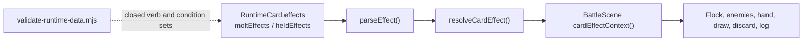

# Bird Squad Core Gameplay Spec

Version: 1.0

Status: consolidated source of truth for combat, cards, Flock Stats, Molt, and
foundation rewards.

Related sources:

- `docs/game/game-design.md` defines the high-level product direction.
- `docs/game/run-design-spec.md` defines route-map and run-system structure.
- `docs/game/alpha-run-spec.md` defines the first playable Map 1 content slice.
- `docs/project/runtime-architecture.md` maps the current code, data, scene, and
  validation boundaries.
- `docs/art/art-bible.md` defines visual identity and card art direction.
- `data/cards/arcana/` defines canonical card identity, species, rarity, and
  production fields.

## Purpose

This document consolidates the former combat, card mechanics, and Flock Stats
contracts. It answers:

- how combat works
- what a card is
- how rewards and improvements work
- how passive Flock Stats work
- how Molt and Open Sky work
- what implementation should build first

Alpha-specific cards, enemies, Waymarks, Signals, Supplies, and tuning live
in `docs/game/alpha-run-spec.md`.

## Foundation Rules

- Bird Squad is a card-based roguelike deckbuilder, not a tactics game.
- The player controls one shared Flock state, not individual bird units.
- The run deck is singleton: it can contain at most one copy of any card ID.
- Cards are birds joining with route memory, skill, shelter, warning patterns,
  fighting style, or survival tricks.
- Every owned playable card contributes passive Flock Stats.
- Reward samples exclude cards already in the run deck.
- Improved cards show a `+` suffix and use their improved effect.
- Foundation combat should prioritize readability before adding new mechanics.

Do not add parked mechanics to the foundation by default: Ruffled, Mark, Bond,
Shine, Scry, Discover, Cleanse, Route, Seed, replay/reflection, status
conversion, intent delay/freeze, temporary cards, or all-four-suits payoffs.

## Shared Terms

| Player Term | Rule |
| --- | --- |
| Cohesion | Shared Flock health. If it reaches 0, the flock scatters. |
| Cover | Temporary defense. Reduces incoming damage and clears at start of player turn. |
| Wingbeats | Energy. Starts at 3 each player turn. |
| Damage | Reduces enemy health. |
| Healing | Restores Flock Cohesion. |
| Draw / Discard | Moves cards through hand, draw pile, and discard pile. |
| Retain | Keeps cards in hand through Roost. A selected card has first priority; remaining slots keep the rightmost unplayed cards. The same priority applies to Retain earned after the enemy acts. |
| Enemy Tell | Visible enemy intent for the next enemy action. |
| Add to the Flock | Post-encounter singleton card reward. |
| Preen a Card | Improve one owned card. |
| Flock Stats | Passive stats supplied by owned cards. |
| Resonance | Plumes tempo resource. Foundation cap target is 5. |
| Winded | Enemy deals roughly 25% less attack damage while active. |
| Molt | A whole-turn transform stance: non-Molt cards cost 1 less, use their alternate Molt abilities, and channel Molt Power. |
| Open Sky | Vulnerable aftermath after Molt; incoming damage is increased. |
| Open Sky Guard | Reduces or blocks Open Sky backlash. |
| Flow | Formation momentum. Card effects build it at most once per card; unblocked damage resets it, while a fully blocked hit preserves it. |
| Hold | The steady formation between Scatter and Surge, with no stat modifier. |
| Surge | Full Flow. Adds 1 to outgoing damage and generated Cover. |
| Scatter | Below 34% Cohesion, outgoing damage and generated Cover are reduced to 75%. |
| Regroup | Leaving Scatter through recovery restores 4 additional Cohesion and returns the flock to Hold or Surge. |

## Combat Loop

1. Start player turn.
2. Clear old Cover.
3. Draw to hand size 4, plus any Draw stat bonus.
4. Set Wingbeats to 3, plus any turn modifiers.
5. Show enemy Tells.
6. Player plays cards until done or out of Wingbeats. Playing 4 or more cards
   before Roost overextends the flock into Open Sky for the enemy phase.
7. Player chooses `Roost`.
8. Enemies resolve their Tells.
9. Status durations tick.
10. If all enemies are defeated, resolve route/reward flow.

Non-boss encounters may also carry one deterministic optional objective. The
current objective pool rewards different visible plans: preserve Flow, trigger
Surge, finish with Cover, avoid Cohesion loss, avoid overextension, win by a
Beat deadline, defeat a priority enemy by its deadline, bank Wingbeat before a
Roost, or block a district-scaled amount of damage. Pools reinforce district
identity: Rooftops teach restraint and formation, Canals emphasize reserves
and protection, Signal Spires emphasize Flow/Surge timing, and High Roost asks
for heavier guards or efficient clears. The compact goal plate reports live
progress and exposes the full rule on hover. Objectives award bonus Scrap and
never turn a combat victory into a loss. Priority objectives also mark the
specific enemy directly above its Cohesion rail, beside the Tell, with the
remaining Beat window; the marker changes to `OBJECTIVE MISSED` when the
deadline passes while the fight remains playable.

When any objective changes from active to complete or failed, the transition is
acknowledged immediately and once: a compact generated callout shows either
`GOAL COMPLETE +Scrap` or `GOAL MISSED`, while distinct success/miss audio cues
mirror the result. Repeated redraws cannot replay the callout or cue. This
feedback is informational and does not interrupt card input or enemy sequencing.

Bosses have one authored phase transition. Crossing from above half Cohesion to
half or below while the boss survives immediately starts Phase II: the boss
discards its current Cover and stored attack bonus, resets its Tell counter, and
switches to its named deterministic Phase II move loop. The half-Cohesion marker,
phase badge, selected-card outcome preview, and boss-prep dossier all disclose
the threshold. The transition log and callout name the new pattern and its first
Tell. A single hit that defeats the boss does not trigger Phase II, and a phase
transition can occur only once per fight.

Good turns should ask the player to choose between at least two attractive
options:

- push damage now
- build Cover before a Tell lands
- recover Cohesion
- apply Winded
- build or use Resonance
- enter Molt and accept Open Sky afterward
- draw/discard to find a better line

## Card Contract

Every playable card has:

- stable ID
- Bird Squad display name
- bird species
- type: Legend, Crew, Molt, or Aviary
- suit, if Crew
- rarity
- cost
- base active effect
- improved active effect
- passive Flock Stats
- optional Preen Flock Stat delta

Card types:

| Type | Role |
| --- | --- |
| Legend | Run-defining, rule-bending cards with strong identity. |
| Crew | Core tactical cards organized by suit. |
| Molt | Risk/reward transformation cards that create burst and exposure. |
| Aviary | Suitless bird-quality cards that add flexible field instincts without being tarot cards. |

Suit jobs:

| Suit | Crew | Foundation Job | Fiction |
| --- | --- | --- | --- |
| Plumes | Brightwing | Resonance, Wingbeat tempo, draw, chains | Display, rhythm, calls, color, performance. |
| Quills | Razorwind | Damage, Winded, conditional strikes | Sharp feathers, messages, signal cuts, tactics. |
| Basins | Tidewatch | Recovery, healing, stabilization | Rain, canals, shelter, care, recovery. |
| Nests | Brassnest | Cover, defense, bracing, setup | Materials, repairs, scaffold nests, preparation. |

Classic suit names may remain in archival data fields for tarot lineage, but
player-facing text uses Plumes, Basins, Quills, and Nests.

## Gameplay Data Contract

Card runtime data should be explicit enough that the card resolver does not need
hardcoded per-card branches except for deliberately unique Legend behavior.

Required runtime fields:

| Field | Type | Rule |
| --- | --- | --- |
| `id` | string | Stable singleton key. Must match card identity data. |
| `displayName` | string | Player-facing Bird Squad card name. |
| `kind` | enum | `legend`, `crew`, `molt`, `aviary`, or `snag`. |
| `suit` | enum/null | `plumes`, `quills`, `basins`, `nests`, or null. |
| `rarity` | enum | `common`, `uncommon`, `rare`, or `legendary`. |
| `cost` | number | Base Wingbeat cost. |
| `target` | enum | `enemy`, `allEnemies`, `self`, `none`, or `choice`. |
| `effects` | string[] | Ordered base effect expressions. |
| `moltEffects` | string[]/optional | Alternate active effect used while the Flock is Molting. |
| `heldEffects` | string[]/optional | Effects that resolve from held Snag-style cards when the runtime checks the hand. |
| `upgrade` | object | Improved cost/effects/Flock Stat delta. |
| `flockStats` | object | Passive whole-number stats granted while owned. |
| `tags` | string[] | Resolver hints such as `attack`, `skill`, `heal`, `cover`, `molt`. |

Upgrade rules:

- Improved cards keep the same ID and gain a `+` display suffix.
- Upgrades may change cost, effect values, conditions, and Flock Stats.
- Upgrades may define stronger `upgrade.moltEffects` for cards with a Molt
  ability.
- Upgrades should not change the card's suit, kind, or bird identity.
- A card can be improved once in the foundation rules.

Snag notes:

- Snags are runtime-only deck cards, not tarot cards.
- Snags do not grant beneficial Flock Stats.
- Snags may use `heldEffects` or friction effects, and are intentionally exempt
  from the arcana-source cross-check.

## Effect Syntax

Implementation specs should use normalized effect expressions. Player-facing
copy can be more flavorful, but data and tests should use these verbs.

Core verbs:

| Expression | Meaning |
| --- | --- |
| `damage(target, N)` | Deal N base damage to the selected enemy. |
| `damagePierce(target, N)` | Deal N damage while bypassing enemy Cover. |
| `damageAll(N)` | Deal N base damage to each enemy. |
| `removeCover(target, N)` | Remove N Cover from the selected enemy. |
| `gainCover(N)` | Gain N base Cover. |
| `overhealCover(N)` | Heal N and convert overflow into Cover. |
| `heal(N)` | Restore N base Cohesion. |
| `loseCohesion(N)` | Lose N Cohesion directly. |
| `damageFlock(N)` | Damage the Flock from a player-card effect. |
| `draw(N)` | Draw N cards. |
| `discard(N)` | After preceding effects resolve, player chooses exactly N cards from the current hand, or every eligible card if fewer remain. |
| `discardUpTo(N)` | After preceding effects resolve, player may choose zero through N cards from the current hand. Back/B explicitly chooses zero. |
| `gainWingbeat(N)` | Gain N Wingbeats this turn. |
| `loseWingbeat(N)` | Lose N Wingbeats this turn. |
| `gainEnergyNextTurn(N)` | Gain N extra Wingbeats next turn. |
| `gainResonance(N)` | Gain N Resonance, capped by Resonance cap. |
| `spendResonance(N)` | Spend N Resonance if available; the next `spentResonance` condition sees whether the spend succeeded. |
| `resonanceBurst(N)` | Spend all Resonance and deal N damage per Resonance spent. |
| `applyWinded(target, N)` | Apply N turns/stacks of Winded to target. |
| `windedBurst(N)` | Consume target Winded and deal N damage per Winded stack. |
| `enterMolt()` | Enter Molt. |
| `gainOpenSkyGuard(N)` | Gain N Open Sky Guard for the current combat. |
| `returnDiscard(filter, drawAfter)` | Pause resolution and let the player choose one matching card from discard to return to hand, then draw `drawAfter`; if none match, continue without a return. |
| `nextCoverBonus(suit, N)` | Next matching suit card this turn gains N base Cover. |
| `retainHand(N)` | Retain up to N cards through Roost. The selected card is retained first; remaining slots take the rightmost unplayed cards. If Retain resolves after the enemy acts, it uses the selection captured at Roost and the same fallback order. |
| `nextTurnDraw(N)` | Draw N extra cards at the start of next player turn. |
| `enemyNextAttackBonus(N)` | Add N damage to the next enemy attack. Used by a small set of risk/reward cards. |
| `enemyGainCover(N)` | Give the first living enemy N Cover. Used by risk/reward cards. |
| `shuffleSelfToDraw()` | Return the resolving card to the draw pile instead of normal discard flow. |
| `exhaustSelf()` | Exhaust the resolving card. Reserved for cards that explicitly need it. |

Conditions use `if CONDITION then EFFECT`. Supported foundation conditions:

| Condition | Meaning |
| --- | --- |
| `firstPlayedThisCombat` | This is the first time this card ID resolved during the current combat. |
| `targetBelowHalf` | Selected enemy is below half health before the effect resolves. |
| `targetHasCover` | Selected enemy currently has Cover. |
| `targetIntendsAttack` | Selected enemy's visible Tell includes damage. |
| `targetWinded` | Selected enemy currently has Winded. |
| `hasResonance` | Current Resonance is at least 1. |
| `noResonance` | Current Resonance is 0. |
| `resonanceAtLeast(N)` | Current Resonance is at least N. |
| `spentResonance` | The immediately preceding `spendResonance` effect succeeded. |
| `playedSuitThisTurn(suit)` | Player already played a card of that suit this turn. |
| `flockSuit(suit,N)` | Run deck contains at least N cards of that suit. |
| `isMolting` | Flock is currently Molting. |
| `openSky` | Flock currently has Open Sky. |
| `fullCohesion` | Current Cohesion equals maximum Cohesion. |
| `cohesionBelowHalf` | Current Cohesion is below half maximum Cohesion. |
| `noCover` | Flock has no Cover. |
| `defeatsEnemy` | The immediately preceding damage effect defeats an enemy. |
| `fullyBlocksNextAttack` | Cover prevents all damage from the next attack. |
| `windedAtLeast(N)` | Selected enemy has at least N Winded. |

Supported value scalars:

| Scalar | Meaning |
| --- | --- |
| `perDiscarded` | Multiply the value by the exact number the player chose for the preceding `discard` or `discardUpTo` effect, including zero. |
| `perWinded` | Multiply the value by the target's current Winded stacks. |
| `perCover` | Multiply the value by current Flock Cover. |

Formula order:

1. Pay card cost.
2. Select target.
3. Resolve effects in written order. A discard pauses after any preceding draws, so newly drawn cards are eligible. A discard-return pauses when reached and shows the then-current eligible discard pile. Later effects resume only after the required choice resolves.
4. Add Flock `Damage` to `damage` and `damageAll` values.
5. Add Flock `Cover` to `gainCover` values.
6. If the card is using its Molt ability, add Molt Power once to its first positive damage, Cover, or recovery value. `damageAll` receives half Molt Power, rounded up, per target.
7. Clamp healing at maximum Cohesion.
8. Apply post-effect triggers such as `defeatsEnemy`.

Flock `Regen`, `Draw`, `Resonance`, `Molt Power`, and `Open Sky Guard` are not
added to every matching card line. They modify their named system rules instead.

### Effect Runner Wiring

`src/game/effects/card-effect-runner.ts` owns the generic switch over card
verbs. `BattleScene` supplies the callbacks that mutate live combat state. When
adding a verb, update both the runner and `tools/validate-runtime-data.mjs`;
otherwise authored data can pass design review while no-oping at runtime.

## Timing And Status Rules

Timing rules:

- Start-of-turn effects resolve before the player draws.
- Cover clears at the start of the player's turn before new Cover is gained.
- Regen resolves after Cover clears and before drawing.
- Draw stat changes the turn draw target before cards are drawn.
- Start-of-turn Resonance is granted after drawing and before the first action.
- Player card effects resolve fully before enemy Tells update.
- Enemy Tells resolve in visible order after `Roost`.
- End-of-turn card costs and temporary modifiers clear after enemy actions.

Status rules:

| Status | Owner | Duration Rule | Stacking Rule |
| --- | --- | --- | --- |
| Winded | Enemy | Ticks down after the enemy acts. | Higher value extends duration/stacks; foundation tuning treats it as roughly 25% attack reduction. |
| Molt | Flock | Lasts through the current player turn and ends at Roost. | Re-entering Molt keeps the stance active without repeating first-entry triggers. |
| Open Sky | Flock | Ticks down after enemy turns. | Duration can refresh; incoming damage increase does not stack unless a later spec adds it. |
| Open Sky Guard | Flock | Lasts for the current combat unless spent. | Each point reduces one Open Sky damage increase by 1. |

Targeting rules:

- Cards with `target: enemy` require one living enemy.
- Cards with `target: allEnemies` do not prompt for a target.
- Cards with `target: self` affect the Flock.
- Cards with `target: none` resolve without a prompt.
- If a card's only legal target disappears before resolution, the card fizzles
  after cost payment only if the implementation supports asynchronous effects.
  Foundation card resolution is synchronous, so this should rarely happen.

## Rarity And Rewards

| Rarity | Default Role | Normal Reward Rate |
| --- | --- | ---: |
| Common | Simple, reliable tactics. | 60% |
| Uncommon | Conditional value, suit synergy, or sequencing payoff. | 30% |
| Rare | Suit engine, capstone, or strong delayed value. | 10% |
| Legendary | Encounter-shaping rule-bender. | 0% in normal rewards |

Special reward targets:

| Reward Source | Common | Uncommon | Rare | Legendary |
| --- | ---: | ---: | ---: | ---: |
| Normal crew reward | 60% | 30% | 10% | 0% |
| Rival Crew / elite | 30% | 45% | 22% | 3% |
| Boss reward | 0% | 20% | 55% | 25% |
| Dedicated Legend offer | 0% | 0% | 0% | 100% |

Minor rarity is rank-based unless a later balance pass overrides it:

| Minor Rank | Rarity |
| --- | --- |
| Ace, 2, 3, 4, 5, Fledgling | Common |
| 6, 7, 8, 9, Outrider | Uncommon |
| 10, Matron, Elder | Rare |

## Flock Stats

Flock Stats are the passive deckbuilding layer. Every owned card changes the
shared Flock even before it is drawn.

Rules:

- Every playable card must grant at least one Flock Stat.
- Flock Stat entries are whole numbers.
- If a card grants a stat, that stat must be at least `+1`.
- Omitted stats count as 0.
- Stats are summed across every owned card before combat.
- Improved cards add their Preen stat delta on top of base stats.
- Snags do not grant beneficial Flock Stats.

Foundation stats:

| Stat | Rule | Primary Fit |
| --- | --- | --- |
| Cohesion | Adds directly to maximum Flock Cohesion. | Basins, Nests |
| Damage | Adds damage to player attack cards. | Quills |
| Cover | Adds Cover to cards that gain Cover. | Nests |
| Regen | Heals at the start of player turn. | Basins |
| Draw | Increases player turn draw target. | Plumes, Nests |
| Resonance | Grants start-of-turn Resonance, capped by Resonance cap. | Plumes |
| Molt Power | Increases the once-per-card value bonus while a card uses its alternate Molt ability. | Molt, Legend |
| Open Sky Guard | Reduces or blocks Open Sky damage increase. | Basins, Molt, Legend |

Suit boundaries:

| Suit | Often | Sometimes | Foundation Never |
| --- | --- | --- | --- |
| Plumes | Resonance, Draw | Damage, rare Cohesion | Regen, Open Sky Guard, Molt Power |
| Quills | Damage | Draw, Cohesion, rare Resonance | Regen, Cover, Open Sky Guard, Molt Power |
| Basins | Cohesion, Regen | Open Sky Guard, Draw, rare Cover | Damage, Resonance, Molt Power |
| Nests | Cover, Cohesion | Draw, rare Open Sky Guard | Damage, Regen, Resonance, Molt Power |
| Molt | Molt Power, Open Sky Guard | Damage, rare Cohesion | Draw, Regen, Cover |
| Legend | Unique packages | Any thematic stat | None, but theme must justify it |
| Aviary | Flexible glue stats tied to bird behavior | Any modest foundation stat | Suit-only identity claims |

Rarity budget:

| Rarity | Baseline Passive Budget | Preen Budget |
| --- | --- | --- |
| Common | One thematic `+1`, sometimes plus `Cohesion +1`. | Add `+1` to main stat or Cohesion. |
| Uncommon | One main stat at `+2`, or two suit-aligned stats at `+1`. | Add `+1` to main stat. |
| Rare | Main stat at `+3`, or `+2` main plus secondaries. | Add `+1` to main and sometimes secondary. |
| Legendary | Larger package plus unique passive/scaling modifier. | Improve unique modifier and key stat. |
| Molt Signature | Molt Power/Open Sky Guard package. | Improve risk/reward modifier. |

The first code-ready card values are in `docs/game/alpha-run-spec.md`. Full-run
card stat values should move into production card data when implemented.

## Molt And Open Sky

Molt is the signature reversal mechanic.

Foundation Molt rule:

1. A card or effect enters Molt.
2. Molt remains active for the rest of the current player turn. Each non-Molt card costs 1 less, minimum 0.
3. Every card resolves its alternate `moltEffects` contract while Molting. Its target, role, and effect can differ from the normal contract.
4. Each Molt-active card adds Molt Power once to its first positive damage, Cover, or recovery effect. Later eligible lines on that card receive no second bonus.
5. Area damage adds half Molt Power, rounded up, to every target. A zero-value Resonance or Winded burst does not consume the bonus, so a later eligible effect can still use it.
6. Molt ends when the player chooses Roost. The Flock enters Open Sky for that enemy phase.

Base Molt Power is `+2`, increased by the deck's Molt Power Flock Stat. The selected-card preview and live resolver must use the same total and eligibility rule.

Open Sky:

- increases incoming damage by 1 while active
- is the visible cost of using Molt
- can be softened by Open Sky Guard

Design target:

Molt should feel obviously powerful when used well, but dangerous before a Heavy
Strike or when Cohesion is low.

## Enemy Tells

Enemies should not be generic HP bags. Each enemy needs a Tell pattern that
teaches one combat idea and expresses why this stretch of route is unsafe.

Foundation Tell types:

| Tell Type | Purpose |
| --- | --- |
| Strike | Tests Cover and Winded. |
| Heavy Strike | Tests Molt greed and defensive planning. |
| Brace | Tests burst timing. |
| Rattle | Tests recovery planning and Open Sky risk. |
| Scavenge | Tests damage race. |

Enemy Tells should be strong enough that ignoring them hurts, but not so strong
that there is only one correct card line.

## Implementation Notes

Build order for the gameplay foundation:

1. Move card definitions from prototype code into typed data.
2. Implement singleton ownership.
3. Implement Flock Stat aggregation.
4. Implement the card effect resolver for foundation effects.
5. Implement Molt/Open Sky timing and presentation.
6. Implement enemy Tell patterns.
7. Implement `Add to the Flock` and `Preen a Card` with previews.
8. Add tests for combat math, singleton rewards, Flock Stats, Molt/Open Sky, and
   Preen stat deltas.

## Acceptance Criteria

Core gameplay is ready when:

- a single fight is interesting to replay without meta progression
- enemy Tells visibly change player choices
- the player can explain why they chose damage, Cover, recovery, draw, or Molt
- Basins read as recovery
- Nests read as Cover/defense
- every owned playable card contributes visible Flock Stats
- adding a card previews active effect and Flock Stat changes
- Preen improves active effect and Flock Stat line
- Molt creates at least one memorable decision per fight
- no parked mechanics are required for the foundation cards to work

## Reward Draft Composition

Combat card rewards are composed rather than drawn as three interchangeable random cards:

1. one card addresses a visible deck need or missing keystone
2. one card reinforces the deck's dominant suit
3. one weighted wildcard preserves surprise and pivot potential

The player may still skip the draft for Scrap. Duplicate singleton cards are never offered.

## Boss Dossiers

Boss knowledge is horizontal progression. When a named boss move finishes its
impact beat and resolves its effects, the account records that boss-and-move
pair once. Windups that are interrupted, previews, and duplicated observations
do not add progress.

Codex reveals only witnessed boss tactics and presents the remaining rows as
undocumented. Run outcomes call out newly observed tactics and prioritize the
most recently encountered incomplete dossier as a concrete next-flight goal.
Dossier completion may award records, lore, presentation, or cosmetic rewards;
it must not grant permanent combat power.

## Card Discovery Collections

The Codex groups discovered cards into Major Arcana, Aviary, Plumes, Quills,
Basins, Nests, and Snags collections. Progress is derived only from card IDs the
player has encountered; locked cards remain hidden and no separate collection
currency exists.

Each collection marks progress at 25 percent (`Trail Mark`), 50 percent (`Field
Notes`), and 100 percent (`Set Seal`). When no unfinished boss dossier takes
priority, the outcome screen may surface the nearest collection milestone as
the next-flight goal. These milestones are informational and cosmetic only and
must never grant permanent combat stats.

## Input Baseline

- Mouse and touch retain direct manipulation.
- Settings groups its controls into Audio, Presentation, Accessibility, and Controls. Only the active section accepts pointer input. Up/Down or Tab traverses all settings in section order; Page Up/Page Down or controller LB/RB switches sections. Left/Right adjusts the focused setting. Opt-in announcements include section, label, current value, and position. Section browsing alone never changes a preference.
- Settings > Controls exposes two six-action keyboard pages. Play defaults are Enter Confirm, Esc Back, Left/Right Previous/Next, `P` Pause, and `R` Roost. Utility defaults are Space Hustle, `X` Run Kit / Skip, `M` Mute, `F` Full Screen, `S` Settings, and `H` How to Play. Run Kit opens Packed Supplies during route and combat play; the same action remains Skip during a card reward.
- Remapping takes effect immediately across active scenes, persists locally when browser storage is available, and swaps conflicting assignments so every configurable action remains reachable. Reset Defaults restores the complete map.
- Keyboard number keys `1-9` remain reserved for direct hand-card and reward-slot selection.
- Route arrows or Tab cycle reachable nodes; the configured Confirm action commits; `1-3` chooses a district contract.
- In combat, configured Previous/Next or Tab moves the visible hand/reward focus, Confirm plays or claims the focused choice, physical Up/Down retargets living enemies when those keys are not remapped, and the separate Roost action ends the Beat. Confirm must never silently substitute for Roost. The current focus, target, bindings, and choice position are exposed through text state.
- Codex uses Tab or D-pad Up/Down to move between section tabs, collection filters, entries, and Back. Configured Previous/Next or D-pad Left/Right changes the focused section/filter or moves through the entry grid; Confirm/A opens or closes a dossier, and Back/B closes the dossier or returns to title. Grid focus scrolls into view automatically.
- Standard controllers use D-pad Left/Right for hand/reward choices, D-pad Up/Down or shoulder buttons to retarget, A to confirm/play, B to dismiss or resume, Y to Roost, X to open Packed Supplies or skip a card reward, and Start to pause on the route or in combat.
- Input actions must pass through the same animation and modal locks as pointer actions.

## Visual, Graphics, And Motion Preferences

- Motion is an accessibility preference with System, Full, and Reduced modes. It governs animation behavior and presentation timing without changing combat math.
- Combat Pace is a sequencing preference with Cinematic, Standard, and Snappy
  modes. It governs repeated enemy staging and combat animation delays without
  changing effect order, intent accuracy, or combat math.
- Animation Pace is a visual-motion preference with Relaxed, Standard, and
  Fast modes. It scales Phaser tween and sprite-animation clocks to 0.8x, 1x,
  or 1.3x across menu, route, profile, and combat presentation. Combat timers,
  effect resolution, enemy intent, text reading floors, and game math remain
  unchanged.
- Text Pace is a reading preference with Relaxed, Standard, and Fast modes.
  It scales encounter-intro reading floors and the hold time of combat banners
  and floating callouts. It does not change damage resolution, animation locks,
  turn timing, or any gameplay rule.
- Contrast is a visual-accessibility preference with Standard and High modes. High increases luminance separation across the complete playfield so text, controls, status rails, and active targets stand apart without replacing authored art or changing game rules.
- Screen Reader is an assistive-technology preference with Off and On modes.
  On mirrors current focus, route selection, combat resources, selected-card
  rules/targeting, rewards, Codex browsing/dossiers, and major overlays through a polite DOM live region.
  It is presentation-only and defaults Off.
- Effects is a rendering-quality preference with Auto, Full, and Lean modes. Auto selects Lean when Save Data is active or the browser reports constrained memory/CPU capacity; otherwise it selects Full.
- Lean removes passive title particles, reduces route set-piece ambience, halves optional particle density, caps concurrent combat particle bursts at two, and renders a smaller static combat-atmosphere field.
- Primary card and enemy attack art, wind-up/release/impact beats, intent tells, hit confirmation, reward choices, and all interactive controls remain present in every Effects mode.
- Effects quality must never change combat sequencing, animation locks, damage timing, enemy pacing, random outcomes, or balance.
- Contrast, Effects, Combat Pace, Animation Pace, and Text Pace preferences
  persist locally when browser storage is available, are included in local
  Save Data backups, and remain usable for the current session when storage is
  blocked.

## Audio Feedback

- Every played card begins with a shared physical cast transient, then adds a
  suit voice: rising and bright for Plumes, crisp and cutting for Quills, round
  and rippling for Basins, low and percussive for Nests, and a restrained paper
  voice for neutral cards and Snags. Consecutive casts rotate through three
  subtle pitch variants so repeated play keeps its identity without becoming a
  mechanically meaningful or erratic signal.
- A card that actually uses its Molt text adds a short ascending shimmer. The
  accent reflects resolved card state; it does not predict or alter combat math.
- Committing a Preen uses a separate upgrade signature in post-combat rewards,
  district prep, and Market service. Selection/arming remains a quiet interface
  confirmation; the upgrade signature plays only when the card actually changes.
- Suit voice, Molt state, draw, discard, upgrade, damage, and reward information
  must remain readable through card glyphs, color-independent labels, rules
  text, animation, and text state. Audio reinforces those signals and never
  carries gameplay-critical information by itself.
- Card voices use the independent Card Voices level and master mute preference.
  Existing installs and older backups inherit their saved SFX level until the
  player sets Card Voices independently. Their synthesis shares the
  interaction-loaded adaptive-audio boundary so it does not enlarge or preload
  the opening path.

## Visual Hierarchy

Bird Squad keeps its enamel, brass, cyan-light, tarot, and rooftop identity while limiting simultaneous focal elements:

- one ornate focal surface carries the current decision
- active information may use up to two supporting rails
- utilities and inactive information use quiet icons, thin borders, lower saturation, or progressive disclosure
- inactive route nodes recede until reachable; boss preparation appears only when the boss becomes relevant
- combat shows completed suit keystones rather than four permanent suit counters
- the combat log presents one recent event, with history available on hover
- reward and outcome ceremonies do not render the battlefield hand, piles, enemies, or command UI underneath
- Markets expose one of Cards, Waymarks, Supplies, or Services at a time
- a combat beat may run one primary generated effect, with secondary particles and glow subject to concurrency budgets
- title setup keeps the selected Leader ornate while available alternatives are restrained and locked Leaders become quiet silhouettes
- route HUDs omit combat-only metrics; combat HUDs omit zero-value Cover and Resonance until those systems become active
- unselected hand cards show a compact two-line effect while the selected card carries the full rules treatment
- card rewards surface the three most useful deck signals rather than presenting every diagnostic at equal weight
- focused Market categories use a local merchandise scrim; Services use labeled rows instead of floating icon-price pairs
- passive ornament does not pulse continuously; ambient motion yields to selection, combat, and reward feedback

### District Route Identity

Each district owns a dedicated 16:9 world backdrop for its route. The artwork
keeps its central traversal field low-contrast and moves skyline, lighting, and
recognizable district landmarks toward the perimeter, where they establish
place without competing with nodes or connections. Route nodes sit directly on
this district scene inside the shared map frame; there is no separate planning
board or laminated backing.

Only Rooftop Blocks is part of the initial boot set. Later district backdrops
load through the lazy route-art module when RouteScene enters that map. Route
readiness telemetry reports the selected backdrop key plus loaded and rendered
state so production tests can reject stale or mismatched district art.

## First Flight Guide

New local profiles begin with an optional, persistent decision guide:

1. Route: choose a reachable node, read Gain/Risk, and Take Route.
2. Card: spend Wingbeats, build Flow, and preview the legal target/result.
3. Roost: end the beat and read `Incoming - Cover = Cohesion` before enemies resolve.
4. Reward: compare the three strongest deck signals and treat Skip as a valid deckbuilding choice.

Only one guide step is active at a time. The guide never disables legal alternatives. How to Play exposes `Skip Guide` while active and `Replay Guide` after skipping or completion. Local guide telemetry retains counters for route commits, cards played, Roosts, rewards resolved, steps seen, skips, and replays.

## Replay Flight

Every win and defeat exposes a true rematch rather than a default-run reset. `Replay Flight` starts a clean run with the finished flight's Leader, Ascension tier, Quick/Full length, and exact procedural route seed. Deck changes, route progress, Scrap, Supplies, Waymarks, and damage do not carry into the rematch.

The outcome report shows the flight code beside the replay promise. Activating the flight code copies a shareable route link containing the exact seed and Quick/Full length. Opening that link presents `Fly Shared Route` on the title screen and launches the same route while leaving Leader and unlocked Ascension selection under the recipient's control; challenge links never bypass progression locks.

The route seed governs player-visible route randomness as well as graph shape.
Cache outcomes, route card drafts, single-card grants, Waymarks, Supplies, and
nested route-effect rolls use stable salts derived from seed, district, node or
choice, and the decision-relevant run state. Replaying or resuming the same
state therefore produces the same offers even if ambient audio/FX randomness
differs; a different seed still produces reward variety. IDs for records and
cosmetic particle jitter are intentionally outside this gameplay contract.

## Leader Personal Records

Every winning flight records a clear against its Leader, Full/Quick length, and
Ascension tier. The record stores clear count and fastest total flight beats;
the existing global Fastest statistic remains a final-boss record for legacy
achievement semantics. First clears and faster tier clears appear as outcome
progress, while slower repeat clears increase the clear count without claiming
a new record. The Profile shows each unlocked Leader's highest Full Ascension
clear and fastest Full and Quick flight. Save sanitization rejects unknown
Leaders, modes, and out-of-range tiers, and older accounts migrate with an empty
record table rather than fabricated history.

Pointer activation and Enter confirm the local rematch; Escape returns to the main menu. This keeps retry intent explicit while preserving the strategic value of learning and sharing a route.

## Strategy Achievements

The Flock Record includes one-flight challenges alongside clear and deck-size
milestones. `Live Wire` asks for three Surges, `Still Air` asks for three fights
without Cohesion loss, `Brace Brigade` asks for 24 blocked damage, and
`Every Promise` asks for three completed district contracts. These challenges
evaluate one finished flight at a time, never cumulative lifetime totals, and
can be earned on a defeat so a strong strategic story still matters when the
final fight is lost.

Achievement ids are additive save data: older accounts keep every earned id and
gain no fabricated completion. Flock Record badge rows are paged six at a time
instead of silently truncating the collection. Pointer controls, Page Up/Page
Down, and LB/RB all reach the same page state; the text-state contract exposes
the visible range, exact requirements, earned state, and input labels.
