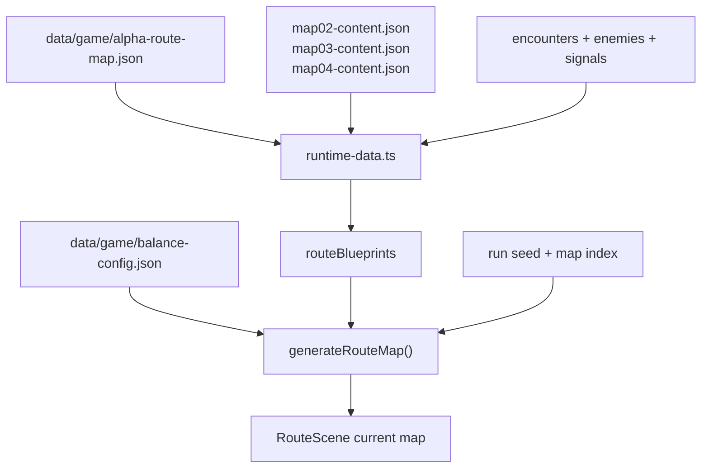

# Bird Squad Run Design Spec

Version: 1.0

Status: consolidated source of truth for route maps, flyway narrative, run
systems, route rewards, economy, events, and bosses.

Related sources:

- `docs/game/game-design.md` defines the high-level product direction.
- `docs/game/core-gameplay-spec.md` defines combat, cards, Flock Stats, and
  Molt.
- `docs/game/alpha-run-spec.md` defines the first playable Map 1 content slice.
- `docs/project/runtime-architecture.md` maps the current route data, generated
  map, effect-runner, and scene wiring.
- `docs/art/art-bible.md` defines visual identity and world language.

## Purpose

This document consolidates the former run map and run systems specs. It answers:

- why the flock is moving through the city
- how the four-map route structure works
- what route node types exist
- how Waymarks, Scrap, Markets, Signals, Supplies, Snags, Rival Crews,
  Basin Stops, Nest Workshops, and bosses work
- what belongs in MVP versus later

Alpha-specific content values live in `docs/game/alpha-run-spec.md`.

## Narrative Frame

The flock is restoring the city's broken flyways: safe routes between rooftops,
basins, markets, signal towers, and high roosts. These routes used to let birds
move, rest, trade, warn each other, and survive the city.

The run is a route-repair mission. Each map is one district route the flock must
reopen. Each boss blocks a chokepoint. Clearing all four maps lets the flock
carry the final signal to the High Roost and reconnect the citywide flyway
network.

Cards join the flock because they bring route memory: shortcuts, shelter,
warning patterns, repair skills, fighting styles, or survival tricks.

## Run Structure

| Layer | Rule |
| --- | --- |
| Run | A complete run contains 4 maps. |
| Map | A branching network of nodes with a boss at the end. |
| Node | A single encounter, recovery stop, reward, event, shop, or boss. |
| Path | The chosen route through connected nodes on the current map. |

Each map should show:

- current node
- available next nodes
- node type icons
- known boss endpoint
- visible route risk
- deck/Flock summary before confirming the next node

Reachable route decisions keep their immediate gain and risk visible after
selection. The commit control uses both the route medallion and the explicit
`Take Route` command so confirmation does not depend on icon recall.

Combat-node risk reads combine the route's authored severity with at most two
actionable encounter pressures, such as multiple foes, Snags, Open Sky, Winded,
enemy Cover, Heavy strikes, tempo loss, poison, or a support unit. Taxonomy-only
tags such as `basic`, `elite`, and `boss` never consume those two slots. The same
compact read appears in the selected-route dock, hover dossier, serialized route
decision, and screen-reader summary so route planning never depends on color or
icon recall alone.

Node gains also use the current flight rather than canned category copy. Combat
nodes name the live deck size; Basins show effective healing after the Cohesion
cap; Nests show meaningful Preen targets and held Scrap; Markets show purchasing
Scrap plus deck size; Caches show open Supply capacity; and Signals show how many
authored choices currently satisfy their costs and requirements. These values
replace the generic gain phrase in the existing dock/tooltip row, so the route
answers `why this path now?` without adding a third annotation or revealing a
future random reward.

Each district also offers one optional contract. Completed contracts persist as
horizontal Flock Record badges and contribute to Leader mastery; they do not
grant permanent combat stats.

## Four-Map Arc

| Map | Working Name | Narrative Job | Mechanical Job |
| --- | --- | --- | --- |
| 1 | Rooftop Blocks | Reopen the local roofline. | Teach core combat, rewards, Preen, first Molt risk. |
| 2 | Canal Markets | Reconnect water, food, repair, and rest stops. | Test recovery and attrition. |
| 3 | Signal Spires | Restore warning calls and skyline signals. | Test tempo, Tells, Plumes/Quills sequencing. |
| 4 | High Roost | Carry the final signal and bind routes together. | Final Flock build, Molt timing, route consequences. |

Map names can evolve in art/world passes, but the four-map structure should stay
stable unless run length is redesigned.

## Node Types

| Node Type | Player Label | Story Role | Mechanical Role |
| --- | --- | --- | --- |
| Normal Encounter | Street Encounter | Clear a blocked route stretch. | Standard fight and card reward. |
| Elite Encounter | Rival Crew | Challenge a crew or threat holding valuable passage. | Harder fight, better rewards. |
| Boss | Boss | Break district chokepoint. | Required map endpoint. |
| Basin Stop | Basin | Recover at water, shelter, or care point. | Heal/stabilize. |
| Nest Workshop | Nest | Repair gear and prepare the flock. | Preen/removal/preparation. |
| Market | Market | Trade in a bird-city exchange. | Spend Scrap on cards, Waymarks, Supplies, services. |
| Signal Event | Signal | Follow rumors, warnings, calls, Waymark leads. | Narrative risk/reward choice. |
| Cache | Rooftop Cache | Find a stash left by route-runners. | Small reward without combat. |

Terminology guardrails:

- Basin is recovery language.
- Nest is upgrade, preparation, Cover, and mechanical support language.
- Signal is event/log language.
- Avoid generic fantasy labels like shrine, campfire, dungeon, relic chest, or
  tavern.

## Map Generation Rules

Each map should be a directed branching graph:

- one start column
- 5-7 route columns before the boss
- 3-5 nodes per middle column
- 2-3 choices from most nodes
- no dead ends except the boss
- at least two materially different route lanes
- one required boss node

Target node counts:

| Node Count | Map 1 | Maps 2-3 | Map 4 |
| --- | ---: | ---: | ---: |
| Normal encounters | 5-7 | 6-8 | 6-8 |
| Rival Crews | 1-2 | 2-3 | 2-4 |
| Basins | 1-2 | 1-2 | 1 |
| Nests | 1-2 | 1-2 | 1-2 |
| Markets | 0-1 | 1-2 | 1 |
| Signals | 1-2 | 2-3 | 2-3 |
| Caches | 1-2 | 1-2 | 1 |
| Boss | 1 | 1 | 1 |

## Route Data Contract

Route data should be buildable as either deterministic authored maps or seeded
procedural maps. Alpha uses an authored Map 1 graph. Later maps can use the same
schema with generated node placement.

Required map fields:

| Field | Type | Rule |
| --- | --- | --- |
| `id` | string | Stable map key, such as `map_01_rooftop_blocks`. |
| `name` | string | Player-facing district name. |
| `index` | number | 1 through 4. |
| `seed` | string/null | Seed used for generated maps; null for authored Alpha map. |
| `columns` | array | Ordered route columns from start to boss. |
| `nodes` | array | All nodes in the map. |
| `edges` | array | Directed connections between node IDs. |
| `bossNodeId` | string | Required final node. |
| `entryNodeId` | string | Required starting node. |

Required node fields:

| Field | Type | Rule |
| --- | --- | --- |
| `id` | string | Stable within the map. |
| `column` | number | Horizontal route position. |
| `lane` | number | Vertical ordering within the column. |
| `type` | enum | `street`, `rival`, `boss`, `basin`, `nest`, `market`, `signal`, or `cache`. |
| `label` | string | Player-facing label. |
| `payloadId` | string | Encounter, event, market, cache, or boss content key. |
| `risk` | enum | `low`, `medium`, `high`, or `boss`. |
| `revealed` | boolean | Whether node type is known to the player. |
| `completed` | boolean | Whether the node has resolved. |

Required edge fields:

| Field | Type | Rule |
| --- | --- | --- |
| `from` | string | Source node ID. |
| `to` | string | Destination node ID. |
| `locked` | boolean | True when a Signal or route effect can unlock it later. |
| `preview` | enum | `known`, `typeOnly`, or `hidden`. |

### Current Route Data Flow

The current build keeps authored district maps as content anchors, then derives
seeded route blueprints from them for each run. The authored maps provide stable
district IDs, entry and boss payloads, content pools, and validation coverage;
`generateRouteMap()` uses the blueprint, run seed, map index, and balance profile
to produce the live graph.

## Route Generation Contract

Generated maps should follow these rules:

1. Create the entry column and boss column.
2. Create 5-7 middle columns.
3. Place 3-5 nodes in each middle column.
4. Assign required node quotas for the current map index.
5. Connect each node to 2-3 nodes in the next column when possible.
6. Ensure every non-boss node has at least one route to the boss.
7. Ensure every route contains at least one combat before the boss.
8. Ensure at least two lanes have meaningfully different risk/reward profiles.
9. Reveal current node, next-node types, and boss endpoint by default.
10. Apply Waymarks or Signals that reveal additional nodes after generation.

The live generator also runs repair passes that keep every generated route
playable: non-boss nodes must reach the boss, opening columns teach combat,
pre-boss columns offer a safety valve, generated routes avoid excessive
consecutive combat pressure, and Rival Crew paths should have alternatives when
the district profile requires them.

Legal transition guardrails:

| From | Avoid Immediately After |
| --- | --- |
| Basin | Basin, Cache |
| Nest | Nest, Market |
| Market | Market, Cache |
| Signal | Signal, Boss unless late-map |
| Rival Crew | Rival Crew before Map 3 |

These are guardrails, not absolute rules. A handcrafted map can break them when
the route choice is clearly intentional.

## Node Resolution Contract

Node resolution should follow one state transition shape:

1. Player previews reachable next nodes.
2. Player commits to one node.
3. Route state moves to that node.
4. Node payload resolves.
5. Rewards, costs, Snags, or route changes apply.
6. Completed node is marked complete.
7. Newly reachable nodes are revealed.
8. Player returns to route preview, unless the map or run is complete.

Node payload rules:

| Type | Payload | Completion Reward |
| --- | --- | --- |
| `street` | Normal encounter ID. | Scrap, Add to the Flock, possible Preen or Waymark. |
| `rival` | Elite encounter ID. | Higher Scrap, improved reward odds, Waymark, Preen. |
| `boss` | Boss encounter ID. | Map-clear rewards and next-map transition. |
| `basin` | Basin option set ID. | Recovery, shelter, or Supply refill. |
| `nest` | Nest option set ID. | Preen, Release a Card, or route preparation. |
| `market` | Market inventory ID. | Purchases only; no automatic reward. |
| `signal` | Signal event ID. | Choice-dependent reward, cost, Snag, or route change. |
| `cache` | Cache table ID. | Small non-combat reward choice. |

Reward ordering after combat:

1. Scrap.
2. Waymark offers, if any.
3. Add to the Flock card reward, if any.
4. Preen offer, if any.
5. Supplies or Snags.
6. Route reveal/change effects.

Singleton card filtering applies before card rewards are shown.

Each district's authored `rewardBias` also shapes card drafts. The three slots
continue to answer a live deck need, reinforce its leading suit, and preserve a
distinct-role/off-suit pivot. Within those constraints, the draft prefers one
card aligned with the district's visible lean when a matching candidate exists;
after that match, the remaining slots keep their normal weighted variety. This
never guarantees a specific card or rarity. The reward ceremony names the
active district lean and marks matching choices so the rule is inspectable
rather than hidden.

Each map profile is also the authority for boss preparation. `primaryTests`
drives the compact boss-node risk read, while `bossPrepHints` supplies the
on-demand plan shown in the boss tooltip and the screen-reader route summary.
The always-visible footer remains a short live readiness scan derived from the
current deck, Supplies, encounter tags, and remaining route nodes. Authored
strategy and live readiness therefore complement one another without turning
the route board into a permanent wall of instructions. Boss advice must never
fall back to a generic test when the district profile provides a specific one.

## Waymarks

Waymarks are Bird Squad's artifact item layer: permanent run modifiers earned by
reopening routes, clearing Rival Crews, resolving Signals, opening Caches, buying
from Markets, or beating bosses. The legacy runtime field remains `routeMarks`
for save compatibility, but player-facing copy should say Waymarks.

Waymarks are real carried objects rather than abstract badges: chalked slate,
gutter metal, repaired harness pieces, market tally strings, signal tags,
charms, tools, and boss trophies. They should feel like found route artifacts
that change how the flock moves through the city.

Rules:

- Waymarks persist for the rest of the run.
- Waymarks are items, not cards, and do not enter the deck.
- Waymarks should be visible in the run inventory and browseable in the Codex.
- Most Waymarks should modify one clear thing.
- Boss Waymarks can be stronger and map-defining.

Current pool:

| Family | Count | Role |
| --- | ---: | --- |
| Safety | 8 | Defense, healing, and survival. |
| Route | 9 | Signals, Caches, route preview, and path value. |
| Economy | 11 | Scrap, Markets, purchases, and exchange rates. |
| Suit | 20 | Plumes, Quills, Basins, and Nests build engines. |
| Molt | 8 | Open Sky safety and transformation payoff. |
| Boss Prep | 2 | Strong map-clear artifacts and boss preparation. |

The runtime field is still named `routeMarks` for save compatibility, but
player-facing text should say Waymarks.

Examples:

| Waymark | Effect |
| --- | --- |
| Chalk Wingmark | Start each combat with Cover. |
| Rooftop Shortcut | First time you play 3 cards in a turn each combat, draw 1. |
| Patched Harness | First Preen each map costs less Scrap. |
| Quiet Landing | First Open Sky damage increase each combat is reduced. |
| Rain Barrel Key | Basin Stops heal more Cohesion. |

## Scrap And Markets

Scrap is the primary economy. The flock spends Scrap at Markets and sometimes at
Nest Workshops.

Scrap sources:

- Street Encounters
- Rival Crews
- Bosses
- Rooftop Caches
- Signals

Scrap sinks:

- buy cards
- buy Waymarks
- buy Supplies
- Release a Card
- pay for extra Preen
- resolve certain Signal choices safely

Market inventory target:

| Slot | Count | Rule |
| --- | ---: | --- |
| Cards | 3-5 | Exclude owned singleton cards. |
| Waymarks | 2-3 | At least one affordable option. |
| Supplies | 2-3 | One-use tactical effects. |
| Services | 1-2 | Release a Card, Preen, or future deck tuning. |

## Release A Card

Release a Card is the deck-trimming service.

Rules:

- Removes one owned non-required card from the run deck.
- Removed cards no longer contribute Flock Stats.
- Starter or story-critical cards can be protected until later.
- Cost increases each time it is used during a run.
- The UI must preview lost active effect and lost Flock Stats.

Narratively, the bird is not destroyed. It leaves the active route team, returns
to a safer perch, scouts elsewhere, or carries a message off-map.

## Supplies

Supplies are one-use tactical tools, Bird Squad's potion-equivalent.

Rules:

- Starting target is 2 carry slots.
- Supplies are consumed when used.
- Supplies can be combat or route-only, but Alpha should focus on combat use.
- Supplies should be simple and high-impact.
- Packed Supplies use one shared interaction in both phases: Run Kit / controller X opens the drawer, Previous/Next or D-pad browses usable items, and Confirm/A activates the focused item. Pointer, keyboard, and controller activation all select first and consume only on a second activation. Back/B clears a selected item before closing, so an accidental input never spends a Supply.

Supply categories:

| Category | Role |
| --- | --- |
| Snacks | Recovery. |
| Flares | Signal, tempo, Tell support. |
| Tools | Defense, repair, Open Sky protection. |
| Calls | Draw, Wingbeats, flock coordination. |

## Snags And Bad Signals

Snags are negative deck cards or burdens attached to tempting choices.

Rules:

- Snags enter the deck like cards.
- Snags should not contribute beneficial Flock Stats.
- Snags can be removed through Release, Nest services, or certain Signals.
- Snags should be rare in MVP and tied to clear risk/reward.

Bad Signals are route-level penalties. They are later-layer unless a specific
event needs them.

## Signals

Signals are narrative event nodes.

Signal structure:

| Part | Requirement |
| --- | --- |
| Situation | One or two sentences explaining the route problem. |
| Choices | 2-3 options with clear costs or risks. |
| Outcome | Immediate mechanical result and short narrative beat. |
| Memory | Optional Waymark, card offer, Scrap, Supply, Snag, or route change. |

Signals should be about route repair, warning calls, stranded birds, rival
bargains, weather, or infrastructure.

Current Signal data is distributed across Map 1's `alpha-signals.json` and the
Map 2-4 district content files. Signal choice outcomes are route-effect strings
resolved by `src/game/effects/route-effect-runner.ts`; requirements are validated
as closed predicates by `tools/validate-runtime-data.mjs`.

## Rival Crews

Rival Crews are elite nodes: optional, dangerous, and rewarding.

Rules:

- Visible on the route map before commitment.
- Harder than normal encounters.
- Tuned around a specific combat test.
- Better reward odds than normal encounters.
- Can be rival birds, predators, infrastructure hazards, or mixed threats, but
  the node label remains Rival Crew for clarity.

Reward target:

- better rarity odds
- high Waymark chance
- medium/high Scrap
- usually Preen after victory
- higher Cohesion loss, Snag, or route pressure risk

## Bosses

Bosses are required route blockers. They should feel like chokepoints, not
random end-of-map monsters.

Boss roles:

| Map | Boss Role | Mechanical Test |
| --- | --- | --- |
| 1 | Rooftop Chokepoint | Cover timing, direct damage, Molt restraint. |
| 2 | Canal Gatekeeper | Attrition, healing windows, longer planning. |
| 3 | Signal Jammer | Tempo, draw, Resonance, Tell reading. |
| 4 | High Roost Blocker | Full build, Molt timing, Open Sky management. |

Boss rewards:

- map-clear Waymark
- stronger Preen or Nest service
- possible Legend or Molt-signature offer
- Scrap
- map transition narrative beat

## Basin Versus Nest

Basins and Nests are the core non-combat pathing tension.

- Basin means recovery, safety, stabilization, and Open Sky relief.
- Nest means Preen, preparation, mechanical tuning, and deck improvement.

Routes should often force a choice between Basin and Nest. A single node should
not usually offer full recovery and full upgrade at once.

## Flock Leaders

Flock Leaders are later replay identities, not MVP.

Possible model:

| Leader Type | Run Identity |
| --- | --- |
| Plumes Leader | Draw, Resonance, fast fights. |
| Quills Leader | Precision damage and Winded. |
| Basins Leader | Recovery and attrition resistance. |
| Nests Leader | Defense, Preen, route control. |
| Molt Leader | Burst and Open Sky management. |

## MVP Cut

Build these for the first full roguelike run:

- Waymarks
- Scrap
- Markets
- Release a Card
- Supplies
- Signals
- Rival Crews
- four map bosses
- Basin Stops
- Nest Workshops
- light Snags attached to high-upside choices

Defer:

- Favors
- broad Bad Signal system
- Flock Leaders
- complex Signal chains
- advanced deck services
- large Waymark pools with rare build-arounds

## Acceptance Criteria

Run design is ready when:

- a run contains exactly four maps
- each map is a branching route with a visible boss endpoint
- route choices affect more than the next fight
- Waymarks give runs identity beyond deck contents
- Scrap creates meaningful Market decisions
- Release a Card gives singleton decks control without breaking flock theme
- Supplies create tactical safety valves
- Signals add narrative choices with mechanical outcomes
- Rival Crews are tempting but risky
- bosses feel like route blockers and reward map completion
- Basin and Nest nodes create recovery-versus-upgrade tension
- the player understands why restoring the flyways matters

## Run Modes And Restoration

The title screen offers two deliberate run lengths:

- **Quick Flight** visits three districts (`Rooftop Blocks`, `Signal Yards`, and `High Roost`) for a shorter complete arc. Quick clears do not unlock higher Ascension tiers.
- **Full Flight** visits all four districts and remains the mastery and Ascension progression path.

Both lengths maintain separate personal records for every Leader and Ascension
tier. A record uses total beats across the flight, so route composition and
combat efficiency both matter; Quick times never overwrite Full times. Only a
first clear or a faster repeat is celebrated as a new record.

Every district offers three visible contract dossiers after the opening teaching fight. The player chooses one; contracts show their goal and Scrap reward before acceptance, pay once, and add a permanent badge to the Flock Record when completed.

Cleared districts and completed contracts restore illuminated flyway segments on the route map. This makes campaign progress visible in the world rather than leaving restoration as outcome copy only.

## First Flight Curriculum

The first three Rooftop Blocks combats introduce one layer at a time:

1. Wingbeats, enemy Tells, Cover, damage, and Roost. No encounter objective competes for attention.
2. Flow and Surge, with a Preserve Flow objective.
3. Molt and Open Sky, with a Clean Roost objective.

District contracts remain hidden until the opening combat is complete.
