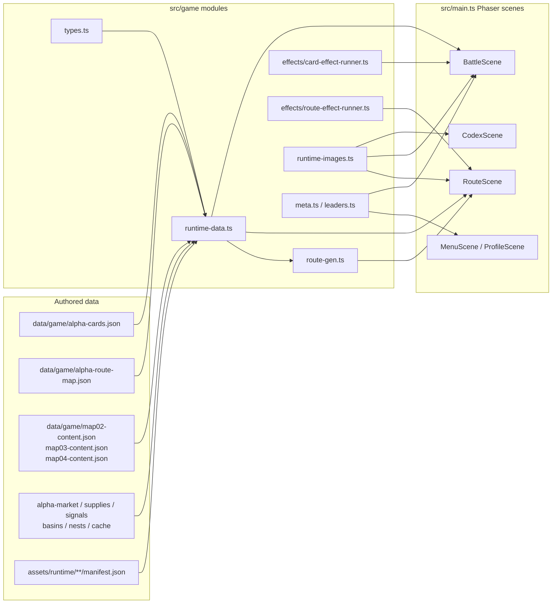
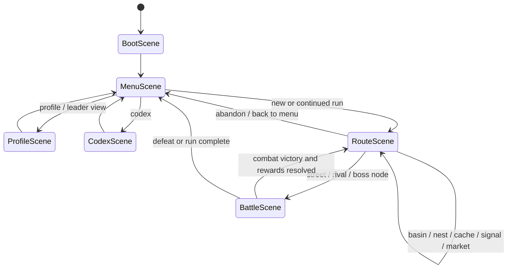
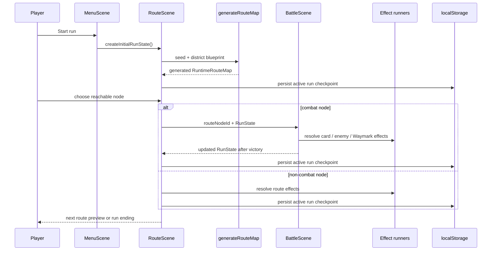
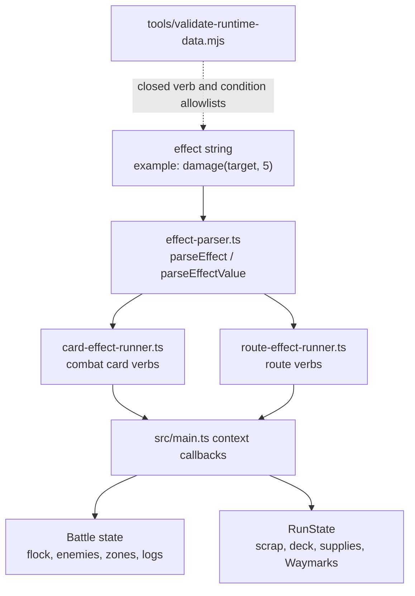
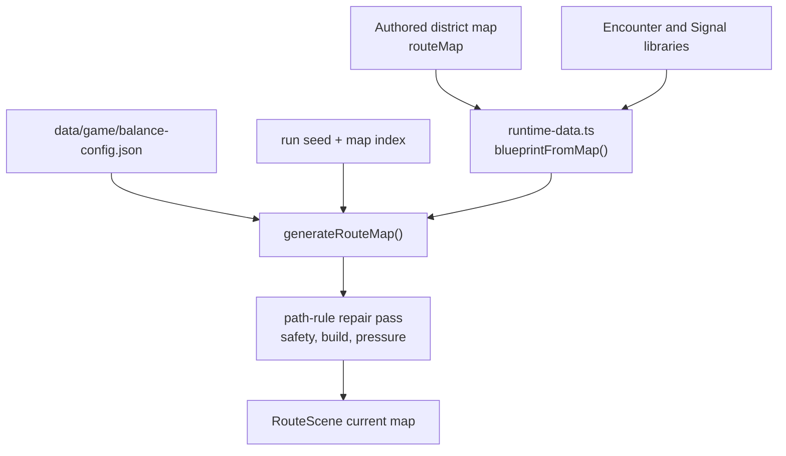
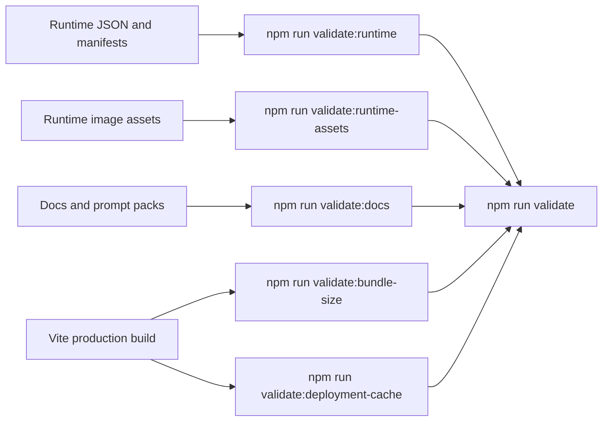

# Bird Squad Runtime Architecture

Status: current codebase map for implementation and documentation maintenance.

This note describes how the playable build is wired today. It is a companion to
the design specs, not a replacement for them:

- Game rules and player-facing terms: `docs/game/`
- Visual and art pipeline rules: `docs/art/`
- Runtime JSON contracts and validation: `data/game/`, `src/game/types.ts`,
  and `tools/validate-runtime-data.mjs`
- Phaser scene implementation: `src/main.ts`

## Current Snapshot

| Area | Current shape |
| --- | --- |
| Runtime framework | Phaser 4 through Vite. |
| Main scene file | `src/main.ts`, with helper modules under `src/game/`. |
| Districts | 4 playable maps: Rooftop Blocks, Canal Markets, Signal Spires, High Roost. |
| Runtime cards | 110 total: 100 playable cards plus 10 Snags. |
| Starter / reward cards | 10 starter cards, 90 reward-pool cards. |
| Enemies / encounters | 64 enemies, 80 encounters. Encounters can spawn up to 4 enemies. |
| Signals / Supplies / Waymarks | 38 Signals, 31 Supplies, 58 Waymarks. |
| Route maps | Authored district maps feed seeded generated maps per run. |
| Persistence | Active run, account unlocks, and run summaries use `localStorage`. |
| Test harness | `window.__birdSquadState()` and `render_game_to_text()` drive Playwright smoke tests. |

## Code And Data Flow

The important boundary is that JSON data names the cards, encounters, route
payloads, items, and art targets. The scene code resolves those names through
typed maps in `runtime-data.ts`, then delegates effect strings to small
interpreters instead of hardcoding most card or route outcomes directly.

## Scene Lifecycle

`RouteScene` owns path choice, non-combat node resolution, Market shelves,
Waymark/Supply drawers, card reward/preen/release pickers, and active-run
checkpoints. `BattleScene` owns combat state, hand/draw/discard zones, enemy
Tells, Supplies used in combat, Waymark combat triggers, rewards after victory,
and run-summary emission.

## Run Lifecycle

## Effect Resolution

Card effects and route effects intentionally share the same simple expression
shape, but they do not share the same verb set. `validate-runtime-data.mjs`
mirrors the runtime interpreters so a typo or unsupported verb fails validation
instead of silently doing nothing in game.

Current card-effect extensions beyond the original foundation set include
`damagePierce`, `removeCover`, `resonanceBurst`, `windedBurst`, `overhealCover`,
`loseCohesion`, `damageFlock`, `retainHand`, `gainEnergyNextTurn`,
`enemyNextAttackBonus`, `enemyGainCover`, `shuffleSelfToDraw`, and `exhaustSelf`.
Cards can also define `heldEffects`, `moltEffects`, and upgraded
`upgrade.moltEffects`.

## Route Generation

The authored maps are still useful content sources: they provide district IDs,
entry and boss payloads, and pools of combat/non-combat payloads. At runtime,
the generated map uses those pools plus `balance-config.json` to produce a
seeded graph with controlled pacing beats, non-combat relief, and boss access.

## Validation And Build Gates

Use `npm run validate` after changes to cards, runtime data, art manifests,
effect syntax, route systems, or mechanics docs. Use `npm run build` when code or
asset loading changes, because the production split and deployment-cache
contract are part of the shipped runtime.

## Maintenance Notes

- `src/main.ts` remains the largest maintenance risk. Prefer moving new generic
  logic into `src/game/` modules when it has a clear data or rules boundary.
- `data/game/alpha-cards.json` is now a broader runtime card file despite the
  historical `alpha` name. It includes the starter deck, reward pool, Legends,
  Crew, Aviary cards, the Molt signature card, and Snags.
- The player-facing term is `Waymarks`; the runtime field remains `routeMarks`
  for compatibility with existing save/run code.
- Snags are runtime-only cards. They are exempt from the tarot arcana source
  cross-check and do not need individual card art manifest entries.
- `CodexScene` lazy-loads extended codex data. Do not eagerly import that data
  into boot paths unless bundle budgets are intentionally revisited.
- Generated/source art belongs under `.generated/`; optimized runtime assets
  belong under `assets/runtime/` and should be referenced through manifests or
  Vite-managed imports.
